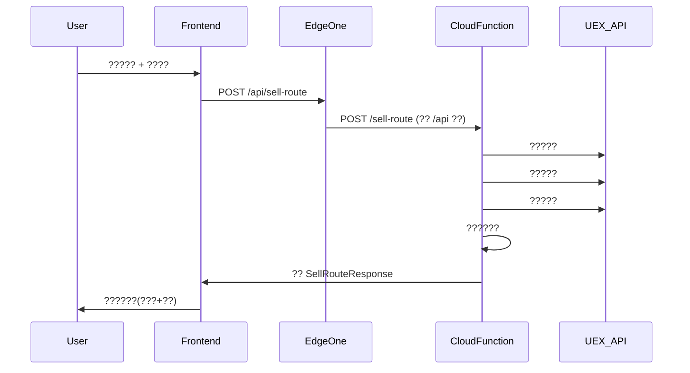

# UEX Trade Navigator - ??????

> ????:EdgeOne Pages(???? + Cloud Functions Python ??)

## 1. ????

**EdgeOne Pages ????**:
- ??:React 19 + MUI + Tailwind CSS(Vite ??)? EdgeOne Pages ????
- ??:Python FastAPI ? EdgeOne Cloud Functions
- ??????,??????

### ????

| ? | ?? | ?? |
|----|------|------|
| ???? | React 19 + Vite 8 | ????,MUI ???? |
| UI ?? | MUI 9 (Material UI) | ??????,??????? |
| ?? | Tailwind CSS 4 | ????????,??????? |
| ???? | FastAPI | ?????,Python ?? |
| ???? | EdgeOne Pages | ?????,?????? |

## 2. ?????????

```
uex-trading-web/
??? cloud-functions/
?   ??? api/
?       ??? index.py                # FastAPI ??(?? app ??)
?       ??? requirements.txt        # Python ??
?       ??? version.py              # ????
?       ??? api/
?       ?   ??? __init__.py
?       ?   ??? routes.py           # API ????(? prefix)
?       ?   ??? schemas.py          # Pydantic ??/????
?       ??? services/
?           ??? __init__.py
?           ??? cache.py            # TTLCache ????
?           ??? uex_api.py          # UEX API ???
?           ??? data_mapper.py      # ????? + ??/????
?           ??? route_planner.py    # ????????
?           ??? trade_chain.py      # ??????
?           ??? warbond_scraper.py  # ????????
??? frontend/
?   ??? package.json
?   ??? vite.config.js              # Vite ??(?? + outDir)
?   ??? tailwind.config.js
?   ??? index.html
?   ??? public/
?   ?   ??? favicon.svg
?   ??? src/
?       ??? main.jsx                # React ??
?       ??? App.jsx                 # ?????
?       ??? theme.js                # MUI ??????
?       ??? components/
?       ?   ??? Layout.jsx          # ????(??+??)
?       ?   ??? Navbar.jsx          # ?????
?       ?   ??? StarBackground.jsx  # ??????
?       ?   ??? SellPanel.jsx       # ????????
?       ?   ??? BuyPanel.jsx        # ????????
?       ?   ??? RouteResult.jsx     # ??????
?       ?   ??? RouteTimeline.jsx   # ????????
?       ?   ??? CommodityInput.jsx  # ??????
?       ?   ??? TerminalSearch.jsx  # ???????
?       ?   ??? LoadingOverlay.jsx  # ????????
?       ??? api/
?           ??? client.js           # API ????(?? /api)
??? edgeone.json                    # EdgeOne ??????
??? scripts/
?   ??? sync_chinese_names.py       # ????????
??? docs/
?   ??? system_design.md
?   ??? class-diagram.mermaid
?   ??? sequence-diagram.mermaid
??? PRD.md
??? ARCHITECTURE.md
??? DEPLOY.md
```

## 3. ???????

### 3.1 ?? API ??

```
POST /api/sell-route
  ??: { origin: string, origin_id: int, items: [{ commodity_id: int, name: string, quantity: int }] }
  ??: SellRouteResponse

POST /api/buy-route
  ??: { origin: string, ship: string, capital: int }
  ??: BuyRouteResponse

GET /api/terminals?q=xxx
  ??: [{ id, name, name_zh, system, system_zh, planet, planet_zh }]

GET /api/commodities?q=xxx
  ??: [{ id, name, name_zh }]

GET /api/vehicles?q=xxx
  ??: [{ id, name, ... }]

GET /api/commodity-prices/{id}
  ??: { commodity prices by terminal }

GET /api/locations?q=xxx
  ??: [{ ... }]

GET /api/warbonds
  ??: { ccu_items: [...], ship_items: [...] }

GET /api/health
  ??: { status, terminals_loaded, commodities_loaded }

GET /api/version
  ??: { version, changelog }
```

### 3.2 ??????

- **????**:EdgeOne Cloud Functions ?? `/api/*` ???????,router ?? prefix
- **????**:Vite proxy ?? `rewrite` ??????,?????
- **??**:???? TTLCache(Cloud Functions ???),? KV ??

## 4. ??????



## 5. ?????

### ??(Cloud Functions)
```
fastapi>=0.104.0
pydantic>=2.5.0
```

### ??
```
react>=19.0.0
react-dom>=19.0.0
@mui/material>=7.0.0
@mui/icons-material>=7.0.0
@emotion/react>=11.11.0
@emotion/styled>=11.11.0
tailwindcss>=4.0.0
axios>=1.6.0
```

## 6. ????(?????)

1. **API ??**:???? `/api/` ????,EdgeOne ?????????
2. **?????**:???????? data_mapper.py ??,???????????
3. **????**:AU(????),??????? "AU" ??
4. **????**:aUEC,??? toLocaleString() ???
5. **????**:CSS ??????,MUI ThemeProvider ??
6. **????**:?????? HTTP ??? + { detail: string },??? Snackbar ??
7. **????**:`cloud-functions/api/version.py` ???????

## 7. ?????

1. ?????????? eo_token ??
2. UEX_API_KEY ??????(EdgeOne ???)
3. `/api/vehicles` ???? 500 ??(???+????)
