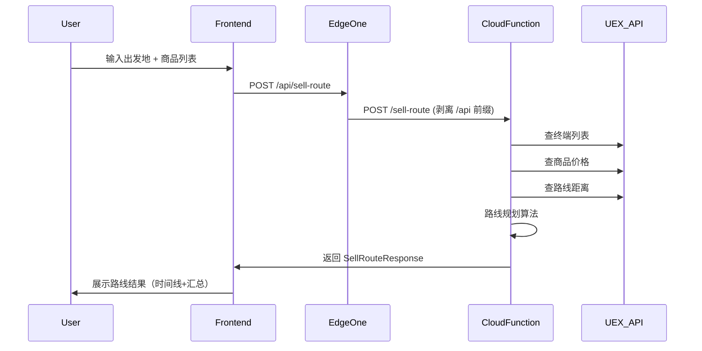

# UEX Trade Navigator — 系统架构设计

> 部署平台：EdgeOne Pages（前端静态 + Cloud Functions Python 后端）

## 1. 实现方案

**EdgeOne Pages 全栈部署**：
- 前端：React 19 + MUI + Tailwind CSS（Vite 构建）→ EdgeOne Pages 静态托管
- 后端：Python FastAPI → EdgeOne Cloud Functions
- 单一平台部署，无前后端分离

### 框架选型

| 层 | 技术 | 理由 |
|----|------|------|
| 前端框架 | React 19 + Vite 8 | 快速开发，MUI 生态丰富 |
| UI 组件 | MUI 9 (Material UI) | 专业级组件库，易定制深色主题 |
| 样式 | Tailwind CSS 4 | 灵活的原子化样式，方便自定义动画 |
| 后端框架 | FastAPI | 高性能异步，Python 生态 |
| 部署平台 | EdgeOne Pages | 国内访问快，免费额度充足 |

## 2. 文件列表及相对路径

```
uex-trading-web/
├── cloud-functions/
│   └── api/
│       ├── index.py                # FastAPI 入口（顶层 app 变量）
│       ├── requirements.txt        # Python 依赖
│       ├── version.py              # 版本信息
│       ├── api/
│       │   ├── __init__.py
│       │   ├── routes.py           # API 路由处理（无 prefix）
│       │   └── schemas.py          # Pydantic 请求/响应模型
│       └── services/
│           ├── __init__.py
│           ├── cache.py            # TTLCache 缓存管理
│           ├── uex_api.py          # UEX API 客户端
│           ├── data_mapper.py      # 中英文映射 + 终端/商品数据
│           ├── route_planner.py    # 路线规划核心算法
│           ├── trade_chain.py      # 链式跑商算法
│           └── warbond_scraper.py  # 战争债券数据抓取
├── frontend/
│   ├── package.json
│   ├── vite.config.js              # Vite 配置（代理 + outDir）
│   ├── tailwind.config.js
│   ├── index.html
│   ├── public/
│   │   └── favicon.svg
│   └── src/
│       ├── main.jsx                # React 入口
│       ├── App.jsx                 # 主应用组件
│       ├── theme.js                # MUI 深空主题配置
│       ├── components/
│       │   ├── Layout.jsx          # 整体布局（导航+背景）
│       │   ├── Navbar.jsx          # 顶部导航栏
│       │   ├── StarBackground.jsx  # 星空粒子背景
│       │   ├── SellPanel.jsx       # 清仓路线输入面板
│       │   ├── BuyPanel.jsx        # 进货路线输入面板
│       │   ├── RouteResult.jsx     # 路线结果展示
│       │   ├── RouteTimeline.jsx   # 时间线式路线展示
│       │   ├── CommodityInput.jsx  # 商品添加组件
│       │   ├── TerminalSearch.jsx  # 终端搜索下拉框
│       │   └── LoadingOverlay.jsx  # 量子跃迁加载动效
│       └── api/
│           └── client.js           # API 请求封装（同源 /api）
├── edgeone.json                    # EdgeOne 区域路由配置
├── scripts/
│   └── sync_chinese_names.py       # 中文名称同步脚本
├── docs/
│   ├── system_design.md
│   ├── class-diagram.mermaid
│   └── sequence-diagram.mermaid
├── PRD.md
├── ARCHITECTURE.md
└── DEPLOY.md
```

## 3. 数据结构和接口

### 3.1 核心 API 端点

```
POST /api/sell-route
  请求: { origin: string, origin_id: int, items: [{ commodity_id: int, name: string, quantity: int }] }
  响应: SellRouteResponse

POST /api/buy-route
  请求: { origin: string, ship: string, capital: int }
  响应: BuyRouteResponse

GET /api/terminals?q=xxx
  响应: [{ id, name, name_zh, system, system_zh, planet, planet_zh }]

GET /api/commodities?q=xxx
  响应: [{ id, name, name_zh }]

GET /api/vehicles?q=xxx
  响应: [{ id, name, ... }]

GET /api/commodity-prices/{id}
  响应: { commodity prices by terminal }

GET /api/locations?q=xxx
  响应: [{ ... }]

GET /api/warbonds
  响应: { ccu_items: [...], ship_items: [...] }

GET /api/health
  响应: { status, terminals_loaded, commodities_loaded }

GET /api/version
  响应: { version, changelog }
```

### 3.2 关键架构约束

- **路由前缀**：EdgeOne Cloud Functions 转发 `/api/*` 时自动剥离前缀，router 不设 prefix
- **本地开发**：Vite proxy 通过 `rewrite` 规则剥离前缀，保持一致性
- **缓存**：使用内存 TTLCache（Cloud Functions 实例级），无 KV 依赖

## 4. 程序调用流程



## 5. 依赖包列表

### 后端（Cloud Functions）
```
fastapi>=0.104.0
pydantic>=2.5.0
```

### 前端
```
react>=19.0.0
react-dom>=19.0.0
@mui/material>=7.0.0
@mui/icons-material>=7.0.0
@emotion/react>=11.11.0
@emotion/styled>=11.11.0
tailwindcss>=4.0.0
axios>=1.6.0
```

## 6. 共享知识（跨文件约定）

1. **API 路由**：前端通过 `/api/` 前缀访问，EdgeOne 转发时自动剥离前缀
2. **中英文映射**：所有映射表在后端 data_mapper.py 维护，前端只接收已翻译的中文
3. **距离单位**：AU（天文单位），前端展示时附带 "AU" 后缀
4. **货币单位**：aUEC，前端用 toLocaleString() 格式化
5. **深色主题**：CSS 变量统一定义，MUI ThemeProvider 注入
6. **错误处理**：后端返回标准 HTTP 错误码 + { detail: string }，前端用 Snackbar 提示
7. **版本管理**：`cloud-functions/api/version.py` 是版本唯一来源

## 7. 待明确事项

1. 自定义域名绑定后关闭 eo_token 认证
2. UEX_API_KEY 环境变量配置（EdgeOne 控制台）
3. `/api/vehicles` 无参数时 500 问题（冷启动+全量加载）
