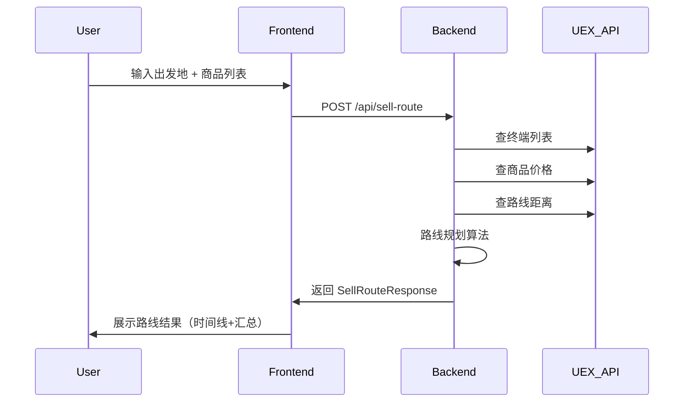

# UEX Trade Navigator — 系统架构设计

> 架构师：高见远 · 架构师（Architect）

## 1. 实现方案

**前后端分离单页应用**：
- 前端：React + MUI + Tailwind CSS（Vite 构建）
- 后端：Python FastAPI（代理 UEX API + 路线规划算法）
- 单一 Docker 部署或本地开发

### 框架选型

| 层 | 技术 | 理由 |
|----|------|------|
| 前端框架 | React 18 + Vite | 快速开发，MUI 生态丰富 |
| UI 组件 | MUI (Material UI) | 专业级组件库，易定制深色主题 |
| 样式 | Tailwind CSS | 灵活的原子化样式，方便自定义动画 |
| 后端框架 | FastAPI | 高性能异步，Python 生态，直接复用现有逻辑 |
| API 通信 | REST + JSON | 简单直接 |

## 2. 文件列表及相对路径

```
uex-trading-web/
├── backend/
│   ├── main.py                    # FastAPI 入口，路由定义
│   ├── api/
│   │   ├── __init__.py
│   │   ├── routes.py              # API 路由处理
│   │   └── schemas.py             # Pydantic 请求/响应模型
│   ├── services/
│   │   ├── __init__.py
│   │   ├── uex_api.py             # UEX API 客户端（curl TLS 处理）
│   │   ├── route_planner.py       # 路线规划核心算法
│   │   └── data_mapper.py         # 中英文映射 + 终端/商品数据
│   └── requirements.txt
├── frontend/
│   ├── package.json
│   ├── vite.config.js
│   ├── tailwind.config.js
│   ├── index.html
│   ├── public/
│   │   └── favicon.svg
│   └── src/
│       ├── main.jsx               # React 入口
│       ├── App.jsx                # 主应用组件
│       ├── theme.js               # MUI 深空主题配置
│       ├── components/
│       │   ├── Layout.jsx         # 整体布局（导航+背景）
│       │   ├── Navbar.jsx         # 顶部导航栏
│       │   ├── StarBackground.jsx # 星空粒子背景
│       │   ├── SellPanel.jsx      # 清仓路线输入面板
│       │   ├── BuyPanel.jsx       # 进货路线输入面板
│       │   ├── RouteResult.jsx    # 路线结果展示
│       │   ├── RouteTimeline.jsx  # 时间线式路线展示
│       │   ├── CommodityInput.jsx # 商品添加组件
│       │   ├── TerminalSearch.jsx # 终端搜索下拉框
│       │   └── LoadingOverlay.jsx # 量子跃迁加载动效
│       └── api/
│           └── client.js          # API 请求封装
├── PRD.md
└── ARCHITECTURE.md
```

## 3. 数据结构和接口

### 3.1 核心 API 端点

```
POST /api/sell-route
  请求: { origin: string, items: [{ name: string, quantity: int }] }
  响应: SellRouteResponse

GET /api/terminals?q=xxx
  响应: [{ id, name, name_zh, system, system_zh, planet, planet_zh }]

GET /api/commodities?q=xxx
  响应: [{ id, name, name_zh }]

POST /api/buy-route
  请求: { origin: string, ship: string, capital: int }
  响应: BuyRouteResponse
```

### 3.2 Pydantic 数据模型

```python
class SellItem(BaseModel):
    name: str
    quantity: int

class SellRouteRequest(BaseModel):
    origin: str
    items: List[SellItem]

class RouteStop(BaseModel):
    terminal_id: int
    terminal_name: str
    terminal_name_zh: str
    system: str
    system_zh: str
    planet: str
    planet_zh: str
    distance_from_prev: Optional[int]
    cumulative_distance: int
    commodities_sold: List[CommoditySold]
    stop_revenue: int

class CommoditySold(BaseModel):
    name: str
    name_zh: str
    quantity: int
    price_per_scu: int
    revenue: int

class SellRouteResponse(BaseModel):
    commodity_summary: List[CommoditySummary]
    shortest_route: List[RouteStop]
    shortest_route_total_distance: int
    shortest_route_total_revenue: int
    max_profit_route: List[RouteStop]
    max_profit_route_total_distance: Optional[int]
    max_profit_route_total_revenue: int
    warnings: List[str]
```

## 4. 程序调用流程



## 5. 任务列表（有序、含依赖）

| # | 任务 | 依赖 | 预估复杂度 |
|---|------|------|-----------|
| T1 | 搭建后端 FastAPI 骨架 + requirements.txt | 无 | 低 |
| T2 | 实现 uex_api.py（curl TLS 处理 + 缓存） | T1 | 中 |
| T3 | 实现 data_mapper.py（中英文映射 + 终端/商品搜索） | T1 | 中 |
| T4 | 实现 route_planner.py（复用 sell_inventory.py 核心算法） | T2, T3 | 高 |
| T5 | 实现 API 路由 + schemas（/api/sell-route, /api/terminals, /api/commodities） | T4 | 中 |
| T6 | 搭建前端 Vite + React + MUI + Tailwind 骨架 | 无 | 低 |
| T7 | 实现深空主题 theme.js + StarBackground + Layout + Navbar | T6 | 中 |
| T8 | 实现 TerminalSearch + CommodityInput + SellPanel 输入组件 | T6, T7 | 中 |
| T9 | 实现 RouteTimeline + RouteResult 结果展示组件 | T6, T7 | 中 |
| T10 | 实现 LoadingOverlay 量子跃迁动效 | T6 | 低 |
| T11 | 实现 api/client.js + 前后端联调 | T5, T8, T9 | 中 |
| T12 | BuyPanel 进货路线（P1） | T11 | 中 |
| T13 | 全局样式打磨 + 响应式适配 | T11 | 低 |

## 6. 依赖包列表

### 后端
```
fastapi>=0.104.0
uvicorn>=0.24.0
pydantic>=2.5.0
httpx>=0.25.0
```

### 前端
```
react>=18.2.0
react-dom>=18.2.0
@mui/material>=5.15.0
@mui/icons-material>=5.15.0
@emotion/react>=11.11.0
@emotion/styled>=11.11.0
tailwindcss>=3.4.0
axios>=1.6.0
```

## 7. 共享知识（跨文件约定）

1. **API 基础 URL**：前端通过 `/api/` 前缀访问后端，Vite dev server 代理到 FastAPI
2. **中英文映射**：所有映射表在后端 data_mapper.py 维护，前端只接收已翻译的中文
3. **距离单位**：AU（天文单位），前端展示时附带 "AU" 后缀
4. **货币单位**：aUEC，前端用 toLocaleString() 格式化
5. **深色主题**：CSS 变量统一定义，MUI ThemeProvider 注入
6. **错误处理**：后端返回标准 HTTP 错误码 + { detail: string }，前端用 Snackbar 提示

## 8. 待明确事项

1. 进货路线 API 详细设计留到 P1 阶段细化
2. 缓存策略：终端列表可长期缓存，价格数据缓存 5 分钟
