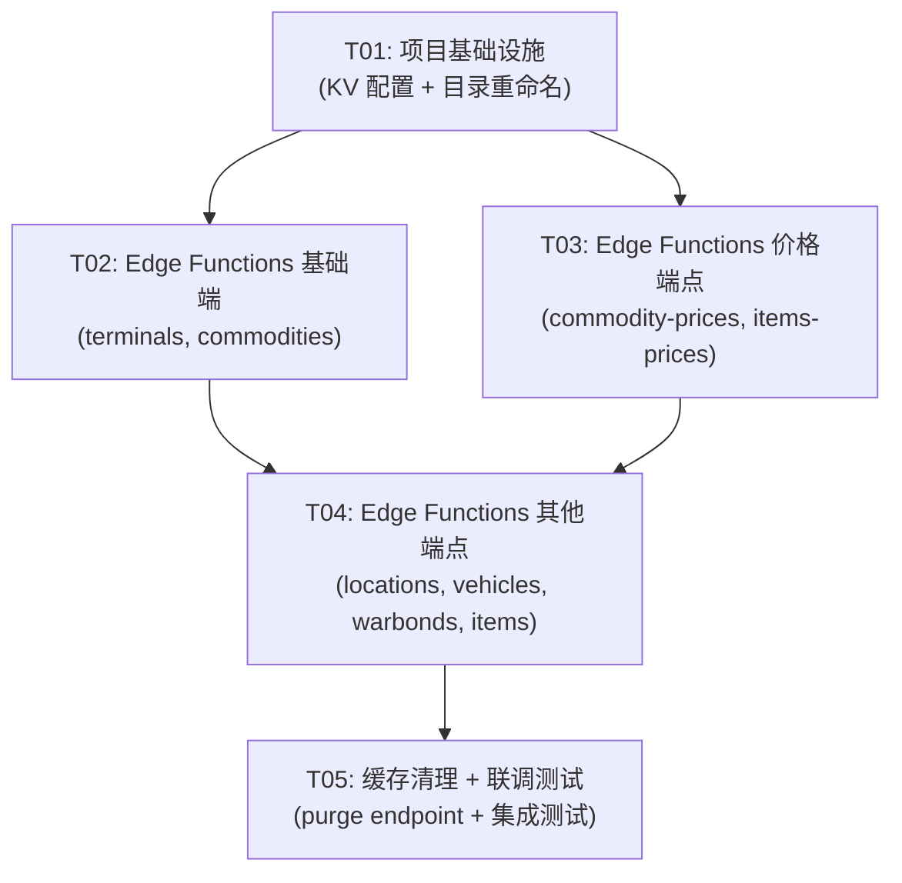

# UEX Trade Navigator — EdgeOne KV 缓存层架构设计

**架构师**: 高见远 (Gao)  
**日期**: 2025-06-07  
**版本**: v1.0

---

## 目录

1. [方案选择说明](#1-方案选择说明)
2. [文件变更清单](#2-文件变更清单)
3. [KV Key-Value Schema](#3-kv-key-value-schema)
4. [Edge Function 逻辑](#4-edge-function-逻辑)
5. [Python 后端变更说明](#5-python-后端变更说明)
6. [前端变更说明](#6-前端变更说明)
7. [任务分解列表](#7-任务分解列表)
8. [风险评估](#8-风险评估)

---

## 1. 方案选择说明

### 1.1 方案对比

| 方案 | 描述 | 优势 | 劣势 |
|------|------|------|------|
| **方案 A（推荐）** | 重命名 `cloud-functions/api/` → `cloud-functions/backend/`，Edge Functions 拦截 `/api/*` | ✅ 前端无需修改<br>✅ 路径清晰分离<br>✅ KV 缓存在边缘层 | ⚠️ 需要配置 EdgeOne 路由规则 |
| 方案 B | Python 后端保持 `/api/` 路径，Edge Functions 用不同路径 | ✅ 后端无需重命名 | ❌ 前端需要修改 baseURL<br>❌ 路径混乱 |

### 1.2 方案 A 可行性确认

**✅ 方案 A 完全可行**，理由如下：

1. **EdgeOne Pages 路由规则支持**：
   - Edge Functions 在 `edge-functions/api/` 目录下可以拦截所有 `/api/*` 请求
   - Cloud Functions 部署在 `cloud-functions/backend/` 可以通过 `/backend/*` 访问
   - EdgeOne 会自动 strip `/backend` 前缀，Python 收到的请求路径为 `/terminals`

2. **KV 访问限制**：
   - Edge Functions 运行在 Cloudflare Workers 运行时，**可以访问 KV 命名空间**
   - Cloud Functions（Python）运行在腾讯云函数环境，**无法访问 EdgeOne KV**
   - 因此缓存层必须放在 Edge Functions 中

3. **前端兼容性**：
   - 前端 `baseURL: '/api'` 无需修改
   - 开发环境 Vite proxy 配置无需修改（`/api` → `localhost:8000`）
   - 生产环境请求自动被 Edge Functions 拦截

### 1.3 架构决策

**核心原则**：
- **边缘缓存**：在 Edge Functions 层实现 KV 缓存，减少回源次数
- **路径分离**：`/api/*` 给 Edge Functions，`/backend/*` 给 Python 后端
- **缓存策略**：不同端点使用不同的 TTL（静态数据长时间，价格数据短时间）
- **优雅降级**：KV 未命中或异常时，直接回源 Python 后端

---

## 2. 文件变更清单

### 2.1 新增文件

| 文件路径 | 说明 |
|----------|------|
| `edge-functions/api/terminals.js` | 终端搜索端点缓存 |
| `edge-functions/api/commodities.js` | 商品搜索端点缓存 |
| `edge-functions/api/commodity-prices/[id].js` | 商品价格端点缓存（动态路由） |
| `edge-functions/api/trade-chain.js` | 贸易链计算端点（不缓存，直接转发） |
| `edge-functions/api/locations.js` | 位置搜索端点缓存 |
| `edge-functions/api/vehicles.js` | 飞船列表端点缓存 |
| `edge-functions/api/warbonds.js` | 战争债券端点缓存 |
| `edge-functions/api/items.js` | 物品搜索端点缓存 |
| `edge-functions/api/items-prices-all.js` | 物品价格批量端点缓存 |
| `edge-functions/api/cache/purge.js` | 缓存清理端点（手动刷新） |
| `edge-functions/_middleware.js` | 全局中间件（可选，用于日志/鉴权） |
| `docs/kv-cache-architecture.md` | 本文档 |

### 2.2 修改文件

| 文件路径 | 变更说明 |
|----------|----------|
| `cloud-functions/api/` → `cloud-functions/backend/` | **目录重命名**，Python 后端代码移动到 `backend/` |
| `cloud-functions/backend/api/routes.py` | **无需修改**，EdgeOne 会自动 strip `/backend` 前缀 |
| `edgeone.json` | **新增 KV 绑定配置** |
| `wrangler.toml`（项目根目录或 edge-functions/） | **新增 KV 命名空间配置** |

### 2.3 文件结构对比

**变更前**：
```
uex-trading-web/
├── cloud-functions/
│   └── api/                    # Python 后端（无法访问 KV）
│       ├── index.py
│       ├── services/
│       └── api/
├── frontend/
│   └── src/api/client.js       # baseURL: '/api'
└── edge-functions/             # 不存在
```

**变更后**：
```
uex-trading-web/
├── cloud-functions/
│   └── backend/                # Python 后端（通过 /backend/* 访问）
│       ├── index.py
│       ├── services/
│       └── api/
├── edge-functions/             # Edge Functions（可访问 KV）
│   ├── api/
│   │   ├── terminals.js        # GET /api/terminals
│   │   ├── commodities.js      # GET /api/commodities
│   │   ├── commodity-prices/
│   │   │   └── [id].js       # GET /api/commodity-prices/:id
│   │   ├── trade-chain.js      # POST /api/trade-chain（不缓存）
│   │   ├── locations.js        # GET /api/locations
│   │   ├── vehicles.js         # GET /api/vehicles
│   │   ├── warbonds.js         # GET /api/warbonds
│   │   ├── items.js            # GET /api/items
│   │   └── items-prices-all.js # GET /api/items-prices-all
│   └── _middleware.js         # 全局中间件（可选）
├── frontend/
│   └── src/api/client.js       # baseURL: '/api'（无需修改）
├── edgeone.json                # 新增 KV 绑定
└── wrangler.toml              # 新增 KV 命名空间配置
```

---

## 3. KV Key-Value Schema

### 3.1 KV 命名空间

建议使用两个 KV 命名空间：

| 命名空间 | 用途 | TTL 范围 |
|----------|------|----------|
| `UEEX_CACHE_STATIC` | 静态数据（终端、商品、位置、飞船、战争债券） | 6-24 小时 |
| `UEEX_CACHE_PRICE` | 价格数据（商品价格、物品价格） | 15 分钟 - 2 小时 |

### 3.2 Key 命名规范

**格式**：`{endpoint}:{params_hash}`

| 端点 | Key 格式 | 示例 |
|------|----------|------|
| `GET /api/terminals?q=xxx` | `terminals:{q}` | `terminals:arean` |
| `GET /api/commodities?q=xxx` | `commodities:{q}` | `commodities:agricium` |
| `GET /api/commodity-prices/{id}` | `commodity-prices:{id}` | `commodity-prices:1` |
| `GET /api/locations?q=xxx` | `locations:{q}` | `locations:lorville` |
| `GET /api/vehicles?q=xxx` | `vehicles:{q}` | `vehicles:freelancer` |
| `GET /api/warbonds` | `warbonds:all` | `warbonds:all` |
| `GET /api/items?q=xxx&category=xxx` | `items:{q}:{category}` | `items:shield:weapon` |
| `GET /api/items-prices-all?category=xxx` | `items-prices-all:{category}` | `items-prices-all:weapon` |

### 3.3 Value 结构

**所有缓存值统一为 JSON 字符串**，格式与 Python 后端响应一致：

```json
{
  "data": [...],          // 实际数据（与后端响应一致）
  "cached_at": 1623062400, // 缓存时间戳（Unix epoch）
  "ttl": 21600            // TTL 秒数
}
```

### 3.4 TTL 策略

| 数据类型 | TTL | 理由 |
|----------|-----|------|
| **终端数据** (`/terminals`) | 6 小时 (21600s) | 终端列表变化不频繁 |
| **商品数据** (`/commodities`) | 24 小时 (86400s) | 商品列表几乎不变 |
| **商品价格** (`/commodity-prices/{id}`) | 15 分钟 (900s) | 价格变化频繁 |
| **位置数据** (`/locations`) | 24 小时 (86400s) | 位置几乎不变 |
| **飞船数据** (`/vehicles`) | 24 小时 (86400s) | 飞船数据不变 |
| **战争债券** (`/warbonds`) | 6 小时 (21600s) | 债券列表变化不频繁 |
| **物品数据** (`/items`) | 24 小时 (86400s) | 物品列表几乎不变 |
| **物品价格** (`/items-prices-all`) | 15 分钟 (900s) | 价格变化频繁 |

### 3.5 缓存控制

- **强制刷新**：请求携带 `?refresh=true` 查询参数时，跳过 KV 缓存，直接回源并更新缓存
- **手动清理**：`POST /api/cache/purge` 端点可以清理指定模式或所有缓存
- **过期策略**：KV 原生支持 expiration TTL，键会自动过期删除

---

## 4. Edge Function 逻辑

### 4.1 通用缓存模式（伪代码）

所有缓存端点的逻辑遵循相同模式：

```javascript
// edge-functions/api/terminals.js

export async function onRequestGet(context) {
  const { request, env } = context;
  const url = new URL(request.url);
  const query = url.searchParams.get('q') || '';
  
  // 1. 构建缓存 key
  const cacheKey = `terminals:${query}`;
  
  // 2. 检查强制刷新
  const refresh = url.searchParams.get('refresh') === 'true';
  
  // 3. 尝试从 KV 读取缓存
  if (!refresh) {
    const cached = await env.UEEX_CACHE_STATIC.get(cacheKey);
    if (cached) {
      const data = JSON.parse(cached);
      return new Response(JSON.stringify(data.data), {
        headers: {
          'Content-Type': 'application/json',
          'X-Cache': 'HIT',
          'X-Cache-Key': cacheKey,
        },
      });
    }
  }
  
  // 4. 缓存未命中，回源 Python 后端
  const backendUrl = new URL('/backend/terminals', url.origin);
  backendUrl.search = url.search; // 保留查询参数
  
  const backendRequest = new Request(backendUrl.toString(), {
    method: 'GET',
    headers: request.headers,
  });
  
  const response = await fetch(backendRequest);
  
  if (!response.ok) {
    return new Response('Backend error', { status: response.status });
  }
  
  const data = await response.json();
  
  // 5. 写入 KV 缓存（TTL 6 小时）
  const cacheData = {
    data: data,
    cached_at: Math.floor(Date.now() / 1000),
    ttl: 21600,
  };
  
  await env.UEEX_CACHE_STATIC.put(
    cacheKey,
    JSON.stringify(cacheData),
    { expirationTtl: 21600 }
  );
  
  // 6. 返回响应
  return new Response(JSON.stringify(data), {
    headers: {
      'Content-Type': 'application/json',
      'X-Cache': 'MISS',
      'X-Cache-Key': cacheKey,
    },
  });
}
```

### 4.2 动态路由处理（商品价格）

```javascript
// edge-functions/api/commodity-prices/[id].js

export async function onRequestGet(context) {
  const { request, env, params } = context;
  const commodityId = params.id;
  
  // 验证 commodityId 是否为数字
  if (!/^\d+$/.test(commodityId)) {
    return new Response('Invalid commodity ID', { status: 400 });
  }
  
  const cacheKey = `commodity-prices:${commodityId}`;
  
  const url = new URL(request.url);
  const refresh = url.searchParams.get('refresh') === 'true';
  
  // 尝试 KV 缓存（使用 PRICE 命名空间）
  if (!refresh) {
    const cached = await env.UEEX_CACHE_PRICE.get(cacheKey);
    if (cached) {
      const data = JSON.parse(cached);
      return new Response(JSON.stringify(data.data), {
        headers: {
          'Content-Type': 'application/json',
          'X-Cache': 'HIT',
        },
      });
    }
  }
  
  // 回源
  const backendUrl = new URL(`/backend/commodity-prices/${commodityId}`, url.origin);
  const response = await fetch(backendUrl.toString());
  
  if (!response.ok) {
    return new Response('Backend error', { status: response.status });
  }
  
  const data = await response.json();
  
  // 写入缓存（TTL 15 分钟）
  const cacheData = {
    data: data,
    cached_at: Math.floor(Date.now() / 1000),
    ttl: 900,
  };
  
  await env.UEEX_CACHE_PRICE.put(
    cacheKey,
    JSON.stringify(cacheData),
    { expirationTtl: 900 }
  );
  
  return new Response(JSON.stringify(data), {
    headers: {
      'Content-Type': 'application/json',
      'X-Cache': 'MISS',
    },
  });
}
```

### 4.3 非缓存端点（贸易链计算）

```javascript
// edge-functions/api/trade-chain.js

export async function onRequestPost(context) {
  const { request, env } = context;
  const url = new URL(request.url);
  
  // 贸易链计算不缓存，直接转发到后端
  const backendUrl = new URL('/backend/trade-chain', url.origin);
  
  const backendRequest = new Request(backendUrl.toString(), {
    method: 'POST',
    headers: request.headers,
    body: request.body,
  });
  
  const response = await fetch(backendRequest);
  
  // 直接返回后端响应（保留状态码、headers 等）
  return new Response(response.body, {
    status: response.status,
    headers: response.headers,
  });
}
```

### 4.4 缓存清理端点

```javascript
// edge-functions/api/cache/purge.js

export async function onRequestPost(context) {
  const { request, env } = context;
  
  try {
    const body = await request.json();
    const { pattern, all } = body;
    
    let deletedCount = 0;
    
    if (all) {
      // 清理所有缓存（需要列出所有键并删除）
      // 注意：KV 不支持批量删除，需要逐键删除
      const staticKeys = await env.UEEX_CACHE_STATIC.list();
      const priceKeys = await env.UEEX_CACHE_PRICE.list();
      
      for (const key of staticKeys.keys) {
        await env.UEEX_CACHE_STATIC.delete(key.name);
        deletedCount++;
      }
      
      for (const key of priceKeys.keys) {
        await env.UEEX_CACHE_PRICE.delete(key.name);
        deletedCount++;
      }
    } else if (pattern) {
      // 按模式清理（例如：terminals:*）
      const [prefix, suffix] = pattern.split(':');
      
      const staticKeys = await env.UEEX_CACHE_STATIC.list({ prefix });
      const priceKeys = await env.UEEX_CACHE_PRICE.list({ prefix });
      
      for (const key of staticKeys.keys) {
        if (suffix === '*' || key.name.endsWith(suffix)) {
          await env.UEEX_CACHE_STATIC.delete(key.name);
          deletedCount++;
        }
      }
      
      for (const key of priceKeys.keys) {
        if (suffix === '*' || key.name.endsWith(suffix)) {
          await env.UEEX_CACHE_PRICE.delete(key.name);
          deletedCount++;
        }
      }
    }
    
    return new Response(JSON.stringify({
      success: true,
      deleted: deletedCount,
    }), {
      headers: { 'Content-Type': 'application/json' },
    });
  } catch (error) {
    return new Response(JSON.stringify({
      success: false,
      error: error.message,
    }), {
      status: 500,
      headers: { 'Content-Type': 'application/json' },
    });
  }
}
```

### 4.5 完整 Edge Function 列表

| 文件路径 | HTTP 方法 | 缓存 TTL | 说明 |
|----------|-----------|----------|------|
| `edge-functions/api/terminals.js` | GET | 6 小时 | 终端搜索 |
| `edge-functions/api/commodities.js` | GET | 24 小时 | 商品搜索 |
| `edge-functions/api/commodity-prices/[id].js` | GET | 15 分钟 | 商品价格（动态路由） |
| `edge-functions/api/trade-chain.js` | POST | **不缓存** | 贸易链计算 |
| `edge-functions/api/locations.js` | GET | 24 小时 | 位置搜索 |
| `edge-functions/api/vehicles.js` | GET | 24 小时 | 飞船列表 |
| `edge-functions/api/warbonds.js` | GET | 6 小时 | 战争债券 |
| `edge-functions/api/items.js` | GET | 24 小时 | 物品搜索 |
| `edge-functions/api/items-prices-all.js` | GET | 15 分钟 | 物品价格批量查询 |
| `edge-functions/api/cache/purge.js` | POST | **不缓存** | 缓存清理 |

---

## 5. Python 后端变更说明

### 5.1 目录重命名影响

**变更操作**：
```bash
# 将 cloud-functions/api/ 重命名为 cloud-functions/backend/
mv cloud-functions/api cloud-functions/backend
```

**影响分析**：

| 项目 | 变更前 | 变更后 | 影响 |
|------|--------|--------|------|
| **目录路径** | `cloud-functions/api/` | `cloud-functions/backend/` | ✅ Python 代码内部 import 路径**无需修改**（相对路径） |
| **访问路径** | `/api/terminals` | `/backend/terminals` | ✅ EdgeOne 会自动 strip `/backend` 前缀，Python 收到的仍是 `/terminals` |
| **Python 路由** | `routes.py` 中定义 `/terminals` | 不变 | ✅ 无需修改 |
| **部署配置** | EdgeOne 自动识别 `cloud-functions/api/` | 需要配置 `edgeone.json` 指定 `cloud-functions/backend/` | ⚠️ 需要更新配置 |

### 5.2 EdgeOne 配置变更

**`edgeone.json` 新增配置**：

```json
{
  "mainlandRegions": ["ap-guangzhou"],
  "overseasRegions": ["ap-singapore"],
  "cloudFunctions": {
    "directory": "cloud-functions/backend",
    "pythonRuntime": "python3.9"
  },
  "kvBindings": [
    {
      "name": "UEEX_CACHE_STATIC",
      "namespace": "ueex-cache-static"
    },
    {
      "name": "UEEX_CACHE_PRICE",
      "namespace": "ueex-cache-price"
    }
  ]
}
```

### 5.3 Python 代码是否需要修改？

**答案：不需要修改**。

理由：
1. **路由不变**：EdgeOne 会将 `/backend/terminals` 转换为 `/terminals` 传递给 Python，因此 `routes.py` 中的路由定义无需修改
2. **Import 路径不变**：目录重命名不影响 Python 代码中的相对 import（例如 `from services.uex_api import ...`）
3. **环境变量不变**：KV 绑定是在 Edge Functions 中访问，Python 后端不访问 KV

---

## 6. 前端变更说明

### 6.1 前端是否需要修改？

**答案：绝大多数情况下不需要修改**，但需要注意以下事项：

### 6.2 无需修改的部分

| 文件 | 说明 |
|------|------|
| `frontend/src/api/client.js` | `baseURL: '/api'` **无需修改**，请求仍发送到 `/api/terminals`，会被 Edge Functions 拦截 |
| `frontend/vite.config.js` | 开发环境 proxy 配置 `/api` → `localhost:8000` **无需修改**，本地开发时不经过 Edge Functions |
| `frontend/src/` 所有组件 | 所有 API 调用都通过 `client.js`，无需修改 |

### 6.3 可能需要修改的部分（可选）

#### 6.3.1 缓存刷新逻辑

前端已经有 `refresh=true` 参数支持（见 `client.js` 第 68 行），**无需修改**。

示例：
```javascript
export const searchTerminals = (q, refresh = false) =>
  cachedGet('/terminals', { q }, refresh, 20000);
```

当 `refresh=true` 时，`cachedGet` 会跳过 localStorage 缓存，并在请求 URL 中添加 `?refresh=true`，Edge Functions 会识别此参数并跳过 KV 缓存。

#### 6.3.2 缓存状态显示（可选增强）

如果希望在前端显示缓存状态（HIT/MISS），可以修改 `client.js` 的响应拦截器：

```javascript
// 可选：读取 Edge Function 返回的 X-Cache 头
api.interceptors.response.use(
  (response) => {
    const cacheStatus = response.headers['x-cache'];
    if (cacheStatus) {
      console.log(`[Cache] ${response.config.url}: ${cacheStatus}`);
    }
    return response;
  },
  undefined
);
```

**这不是必须的**，可以先实现 Edge Functions 缓存，再逐步增强前端体验。

---

## 7. 任务分解列表

### 7.1 任务依赖图



### 7.2 详细任务列表

#### T01: 项目基础设施（KV 配置 + 目录重命名）

**Task ID**: T01  
**优先级**: P0  
**依赖**: 无

**Source Files**:
- `cloud-functions/api/` → `cloud-functions/backend/` （目录重命名）
- `edgeone.json` （修改：新增 KV 绑定 + Cloud Functions 目录配置）
- `wrangler.toml` （新增：KV 命名空间配置）
- `edge-functions/api/_utils/cache.js` （新增：KV 缓存工具函数）
- `edge-functions/api/_utils/response.js` （新增：响应处理工具函数）

**Description**:
1. 重命名 `cloud-functions/api/` 为 `cloud-functions/backend/`
2. 配置 `edgeone.json`，指定 Cloud Functions 目录为 `cloud-functions/backend`，并绑定 KV 命名空间
3. 创建 `wrangler.toml`（如果不存在），配置 KV 命名空间 ID
4. 创建 Edge Functions 工具函数：
   - `_utils/cache.js`：封装 KV 读取/写入逻辑
   - `_utils/response.js`：封装响应格式化逻辑

**验收标准**:
- 目录重命名完成，Python 后端代码完整移动到 `backend/`
- `edgeone.json` 配置正确
- 工具函数可被正确 import

---

#### T02: Edge Functions 基础端点（terminals, commodities）

**Task ID**: T02  
**优先级**: P0  
**依赖**: T01

**Source Files**:
- `edge-functions/api/terminals.js` （新增）
- `edge-functions/api/commodities.js` （新增）
- `edge-functions/api/_utils/cache.js` （修改：新增 `getStaticCache`, `setStaticCache`）
- `docs/kv-cache-testing.md` （新增：测试指南）

**Description**:
1. 实现 `terminals.js`：
   - GET 请求处理
   - 查询参数解析（`q`）
   - KV 缓存读取（`UEEX_CACHE_STATIC`）
   - 回源逻辑（`/backend/terminals`）
   - KV 缓存写入（TTL 6 小时）
   
2. 实现 `commodities.js`：
   - 类似逻辑
   - TTL 24 小时

3. 更新工具函数，支持通用缓存模式

4. 编写测试指南（本地用 `wrangler dev` 测试）

**验收标准**:
- `GET /api/terminals?q=xxx` 正确返回数据
- 首次请求 MISS，第二次请求 HIT
- `?refresh=true` 可强制刷新缓存

---

#### T03: Edge Functions 价格端点（commodity-prices, items-prices）

**Task ID**: T03  
**优先级**: P0  
**依赖**: T01

**Source Files**:
- `edge-functions/api/commodity-prices/[id].js` （新增，动态路由）
- `edge-functions/api/items-prices-all.js` （新增）
- `edge-functions/api/_utils/cache.js` （修改：新增 `getPriceCache`, `setPriceCache`）

**Description**:
1. 实现 `commodity-prices/[id].js`：
   - 动态路由参数解析（`params.id`）
   - 参数验证（必须为数字）
   - KV 缓存读取（`UEEX_CACHE_PRICE`）
   - 回源逻辑
   - KV 缓存写入（TTL 15 分钟）

2. 实现 `items-prices-all.js`：
   - 类似逻辑
   - TTL 15 分钟

3. 更新工具函数，支持价格缓存命名空间

**验收标准**:
- `GET /api/commodity-prices/1` 正确返回数据
- 缓存 TTL 为 15 分钟
- 动态路由正确匹配

---

#### T04: Edge Functions 其他端点（locations, vehicles, warbonds, items, trade-chain）

**Task ID**: T04  
**优先级**: P1  
**依赖**: T02, T03

**Source Files**:
- `edge-functions/api/locations.js` （新增）
- `edge-functions/api/vehicles.js` （新增）
- `edge-functions/api/warbonds.js` （新增）
- `edge-functions/api/items.js` （新增）
- `edge-functions/api/trade-chain.js` （新增，不缓存）
- `edge-functions/api/sell-route.js` （新增，不缓存）
- `edge-functions/api/buy-route.js` （新增，不缓存）

**Description**:
1. 实现静态数据端点（`locations`, `vehicles`, `warbonds`, `items`）：
   - 复用 T02 的缓存模式
   - TTL 根据数据类型设置（6h/24h）

2. 实现非缓存端点（`trade-chain`, `sell-route`, `buy-route`）：
   - 直接转发 POST 请求到后端
   - 不缓存计算结果（每次计算都不同）

**验收标准**:
- 所有静态数据端点正确缓存
- 所有计算端点正确转发且不缓存
- 响应格式与 Python 后端一致

---

#### T05: 缓存清理 + 联调测试

**Task ID**: T05  
**优先级**: P1  
**依赖**: T02, T03, T04

**Source Files**:
- `edge-functions/api/cache/purge.js` （新增）
- `edge-functions/_middleware.js` （可选，新增）
- `docs/kv-cache-architecture.md` （修改：补充测试章节）
- `scripts/test-kv-cache.js` （新增：自动化测试脚本）

**Description**:
1. 实现 `cache/purge.js`：
   - POST 请求处理
   - 支持按模式清理（`pattern: "terminals:*"`）
   - 支持清理所有缓存（`all: true`）
   - 返回删除键数量

2. （可选）实现 `_middleware.js`：
   - 记录请求日志
   - 添加 CORS headers
   - 错误处理

3. 编写自动化测试脚本：
   - 测试所有端点的缓存逻辑
   - 测试缓存清理功能
   - 测试强制刷新功能

4. 集成测试：
   - 本地用 `wrangler dev` 测试 Edge Functions
   - 部署到 EdgeOne Pages 测试生产环境
   - 验证前端请求正确被缓存

**验收标准**:
- `POST /api/cache/purge` 正确清理缓存
- 所有端点集成测试通过
- 前端应用在生产环境正常工作

---

## 8. 风险评估

### 8.1 技术风险

| 风险 | 影响 | 概率 | 缓解措施 |
|------|------|------|----------|
| **EdgeOne KV 配额限制** | KV 有免费额度限制（例如 1GB 存储、100k 读取/天） | 中 | 1. 为不同数据类型设置合理的 TTL<br>2. 监控 KV 使用量<br>3. 必要时升级付费计划 |
| **缓存一致性问题** | UEX API 数据更新后，KV 缓存可能过期 | 低 | 1. 价格数据 TTL 设置较短（15分钟）<br>2. 提供手动刷新接口（`/cache/purge`）<br>3. 前端支持 `refresh=true` 参数 |
| **Edge Functions 冷启动** | Edge Functions 首次调用可能较慢 | 低 | 1. KV 读取延迟很低（< 50ms）<br>2. 可以忽略，因为缓存命中后直接返回 |
| **动态路由配置错误** | `commodity-prices/[id].js` 可能不匹配 | 中 | 1. 本地用 `wrangler dev` 充分测试<br>2. 参考 EdgeOne 动态路由文档 |
| **KV 绑定配置错误** | Edge Functions 无法访问 KV | 高 | 1. 仔细检查 `edgeone.json` 配置<br>2. 在 Edge Functions 中打印 `env` 对象调试 |

### 8.2 运维风险

| 风险 | 影响 | 概率 | 缓解措施 |
|------|------|------|----------|
| **部署顺序错误** | 先部署 Edge Functions，但后端还未重命名，导致 404 | 中 | 1. 先重命名后端目录并部署<br>2. 再部署 Edge Functions |
| **KV 命名空间未创建** | Edge Functions 部署失败 | 高 | 1. 在 EdgeOne 控制台手动创建 KV 命名空间<br>2. 获取命名空间 ID 并配置到 `wrangler.toml` |
| **本地开发环境差异** | 本地 `wrangler dev` 无法访问生产 KV | 低 | 1. 本地开发时禁用 KV 缓存（直接回源）<br>2. 用 `env.UEEX_CACHE_STATIC` 判断是否存在 |

### 8.3 性能风险

| 风险 | 影响 | 概率 | 缓解措施 |
|------|------|------|----------|
| **KV 读取延迟** | 相比直接回源，KV 读取增加延迟 | 低 | 1. KV 读取延迟通常 < 50ms<br>2. 缓存命中后无需回源，总体延迟更低 |
| **缓存穿透** | 恶意请求不存在的 `commodity-id`，导致每次都回源 | 低 | 1. 对参数进行验证（例如 `id` 必须为数字）<br>2. 对不存在的数据也进行短 TTL 缓存（1分钟） |
| **缓存雪崩** | 大量缓存同时过期，导致后端压力激增 | 低 | 1. 在 TTL 基础上增加随机抖动（例如 15分钟 ± 2分钟）<br>2. UEX 数据本身变化不频繁，不太可能同时过期 |

### 8.4 总体风险评级

**低风险**：方案 A 技术成熟，Edge Functions + KV 是 Cloudflare Workers 的经典用法，文档完善。

**建议**：
1. **先本地测试**：用 `wrangler dev` 在本地完整测试 Edge Functions 逻辑
2. **灰度部署**：先部署到测试环境（例如 `test.uex.example.com`），验证无误后再部署到生产
3. **监控告警**：部署后监控 KV 使用量、缓存命中率、后端响应时间

---

## 9. 部署检查清单

### 9.1 部署前

- [ ] 在 EdgeOne 控制台创建 KV 命名空间：`ueex-cache-static` 和 `ueex-cache-price`
- [ ] 获取 KV 命名空间 ID，配置到 `wrangler.toml`
- [ ] 本地测试 Edge Functions（`wrangler dev`）
- [ ] 确认 Python 后端在 `cloud-functions/backend/` 目录中可正常运行

### 9.2 部署时

- [ ] 先部署 Python 后端（重命名目录后）
- [ ] 再部署 Edge Functions
- [ ] 验证 `edgeone.json` 配置正确

### 9.3 部署后

- [ ] 测试所有 API 端点，确认缓存正常工作
- [ ] 监控 KV 使用量（EdgeOne 控制台）
- [ ] 用浏览器 DevTools 检查 `X-Cache` 响应头
- [ ] 测试缓存清理功能（`POST /api/cache/purge`）

---

## 10. 附录

### 10.1 EdgeOne Pages 目录结构规范

根据 EdgeOne Pages 文档：
- **Edge Functions**：放在 `edge-functions/` 目录下，文件路径映射为 URL 路径
  - 例如 `edge-functions/api/terminals.js` → `/api/terminals`
  - 动态路由：`edge-functions/api/commodity-prices/[id].js` → `/api/commodity-prices/:id`
- **Cloud Functions**：放在 `cloud-functions/` 目录下，需要在 `edgeone.json` 中配置
  - 默认识别 `cloud-functions/api/`，可通过配置修改

### 10.2 KV 免费额度（参考）

| 项目 | 免费额度 | 超出后 |
|------|----------|--------|
| 存储容量 | 1 GB | 付费 |
| 读取次数/天 | 100,000 | 付费 |
| 写入次数/天 | 1,000 | 付费 |
| 删除次数/天 | 1,000 | 付费 |

**预估使用量**：
- 存储：每个缓存键约 1-10KB，1000 个键约 10MB，远低于 1GB
- 读取：假设每天 1000 个用户，每个用户 10 次 API 调用，共 10k 次/天，低于 100k
- 写入：TTL 到期后自动重新缓存，预估 1k 次/天，低于 1k

**结论**：免费额度足够使用，无需付费。

### 10.3 参考资料

- [EdgeOne Pages 文档](https://www.tencentcloud.com/document/product/1145)
- [Cloudflare Workers KV 文档](https://developers.cloudflare.com/workers/runtime-apis/kv/)
- [Wrangler CLI 文档](https://developers.cloudflare.com/workers/wrangler/)

---

**文档结束**

_本文档由架构师高见远（Gao）编写，版权归 UEX Trade Navigator 项目团队所有。_
