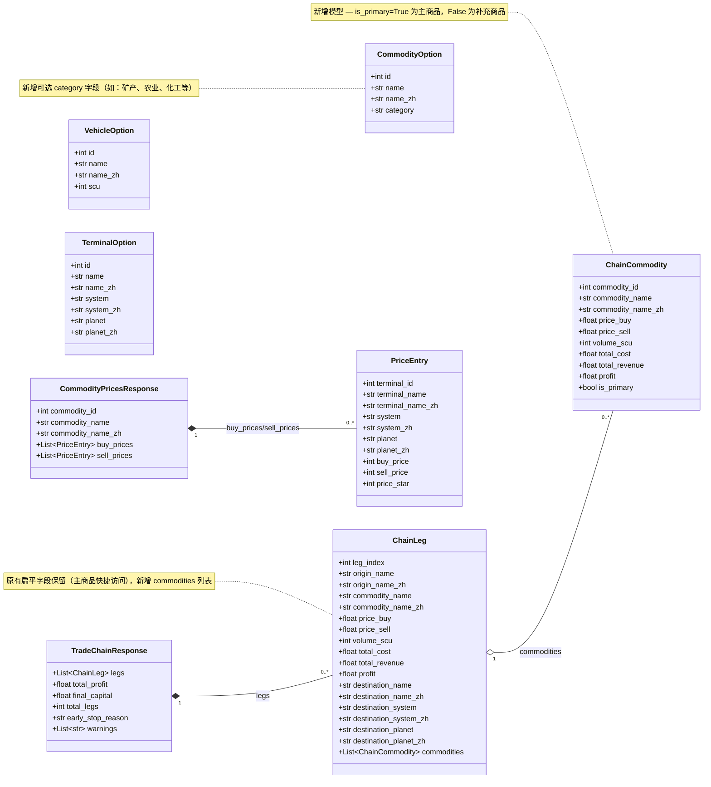
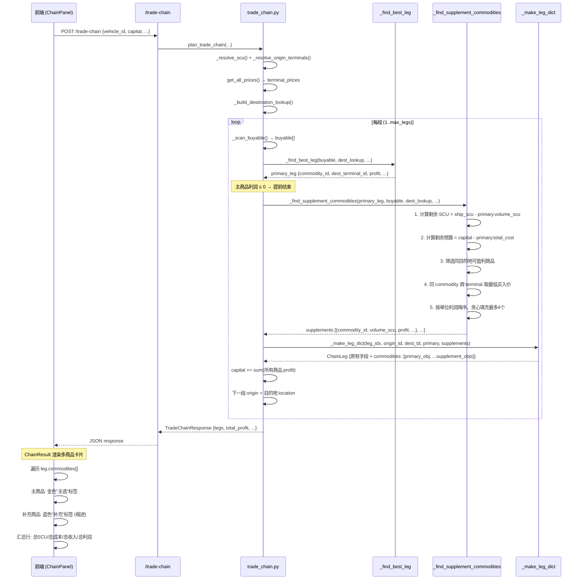
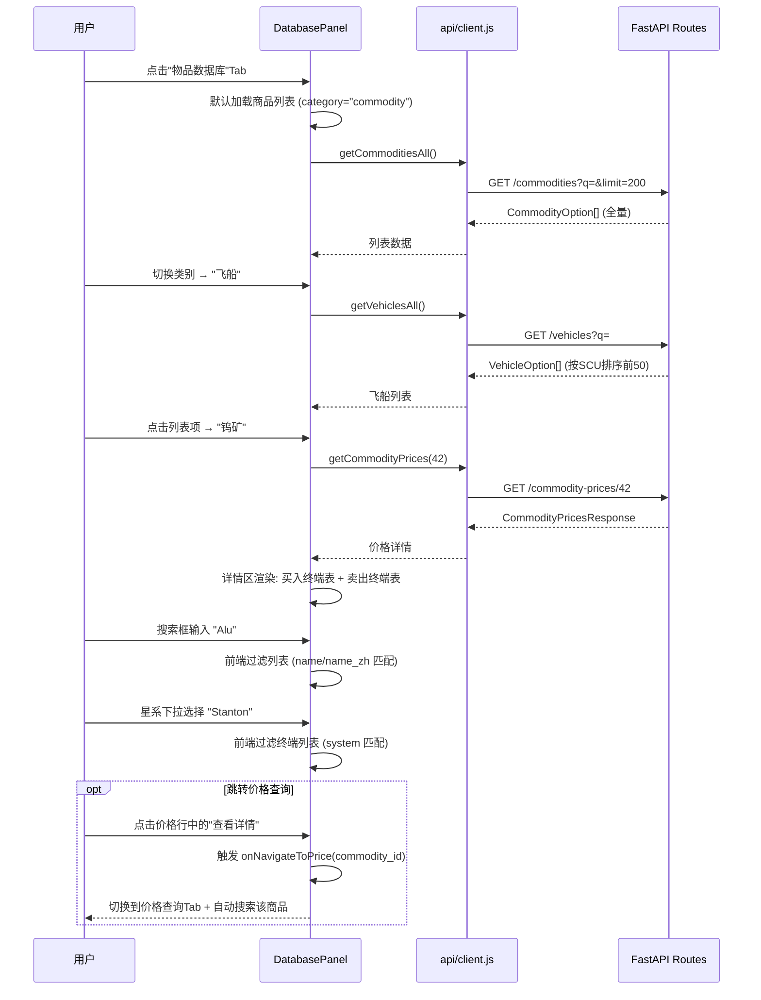
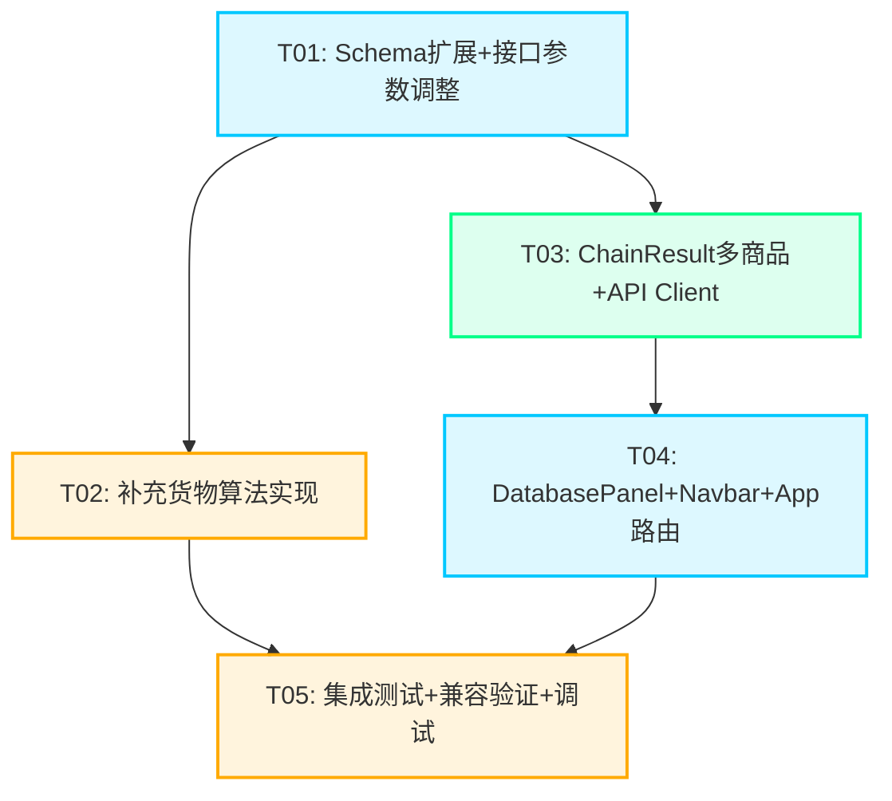

# UEX Trade Navigator 第三阶段 — 系统架构设计 + 任务分解

> 架构师：高见远（Gao）| 日期：2025-07
> 基于：Phase 3 PRD v1.0

---

## 1. 实现方案 + 框架选型

### 1.1 核心技术挑战

| 挑战 | 分析 | 解决方案 |
|------|------|----------|
| 补充货物算法 | 主商品选定后，需在剩余 SCU/预算内贪心填充副商品，且必须同目的地 | 贪心算法：按单位利润降序排列候选商品，依次填入直到 SCU 或预算耗尽，最多 4 个补充 |
| 同地点多终端价格合并 | 同一 location 下多个 terminal 可能卖同一商品，价格不同 | 对补充候选商品取最低买入价（与主商品 `_scan_buyable` 逻辑一致，同一 location 多 terminal 合并取最优） |
| ChainLeg 向后兼容 | 新增 `commodities` 列表字段不能破坏旧客户端 | 保留原有扁平字段（`commodity_name` 等）作为主商品快捷访问，新增 `commodities: List[ChainCommodity]` 为可选字段，默认 `None` 时旧客户端自动忽略 |
| 物品数据库零新接口 | 数据库面板需展示商品/飞船/终端列表+详情，但不新增后端接口 | 复用 `/commodities`、`/vehicles`、`/terminals`、`/commodity-prices/{id}` 现有接口，前端传参调整（不传 q 获取全量列表） |
| 大数据量列表性能 | 终端数 >100，全量渲染可能导致卡顿 | 前端分页（每页 50）+ 搜索过滤，暂不引入虚拟滚动库 |

### 1.2 框架与库选型

| 层次 | 选型 | 理由 |
|------|------|------|
| 后端框架 | FastAPI (现有) | 无需变更，Python 异步框架已稳定运行 |
| 数据验证 | Pydantic v2 (现有) | 新增 `ChainCommodity` 模型，与现有 schema 一致 |
| 前端框架 | React 18 + Vite (现有) | 无需变更 |
| UI 组件库 | MUI v5 (现有) | 复用 Autocomplete、Table、Chip 等已有组件 |
| 样式方案 | Tailwind CSS (现有) + MUI sx | 与项目现有风格一致 |
| 图标 | @mui/icons-material (现有) | 新增 `Database`/`Storage` 图标用于 Navbar |
| 状态管理 | React useState (现有) | DatabasePanel 内部状态管理即可，无需引入全局状态库 |

### 1.3 架构模式

- **后端**：Service 层模式（`trade_chain.py` 是核心服务，`routes.py` 是薄路由层）
- **前端**：组件化 + Props 向下传递（与现有 App→Panel→Result 模式一致）
- **数据流**：单向数据流，API 调用集中在 `client.js`

---

## 2. 文件列表及相对路径

### 2.1 需修改的文件

| 文件路径 | 修改内容 |
|----------|----------|
| `cloud-functions/api/services/trade_chain.py` | 新增 `_find_supplement_commodities` 方法；修改 `plan_trade_chain` 调用补充逻辑；修改 `_make_leg_dict` 输出多商品格式 |
| `cloud-functions/api/api/schemas.py` | 新增 `ChainCommodity` 模型；`ChainLeg` 新增 `commodities` 可选字段；`CommodityOption` 新增 `category` 可选字段 |
| `cloud-functions/api/api/routes.py` | `/commodities` 端点支持 `limit` 参数；导入新 schema |
| `frontend/src/components/ChainResult.jsx` | 多商品列表渲染：主选标签 + 补充标签 + 汇总行 |
| `frontend/src/components/Navbar.jsx` | 新增 `database` Tab（第 6 个，图标 Storage） |
| `frontend/src/App.jsx` | 新增 `isDatabase` 标志 + DatabasePanel lazy import + 全宽布局渲染 |
| `frontend/src/api/client.js` | 新增 `getCommoditiesAll`、`getVehiclesAll`、`getTerminalsAll` 函数（复用现有接口，不带搜索参数） |

### 2.2 需新增的文件

| 文件路径 | 内容 |
|----------|------|
| `frontend/src/components/DatabasePanel.jsx` | 物品数据库面板：类别切换、搜索、列表、详情 |

---

## 3. 数据结构和接口（类图）



### 3.1 ChainCommodity 字段说明

| 字段 | 类型 | 说明 |
|------|------|------|
| `commodity_id` | int | UEX 商品 ID |
| `commodity_name` | str | 英文名称 |
| `commodity_name_zh` | str | 中文名称（通过 `get_commodity_zh` 获取） |
| `price_buy` | float | 买入单价（aUEC/SCU），取同地点最低价 |
| `price_sell` | float | 卖出单价（aUEC/SCU），目的地的卖出价 |
| `volume_scu` | int | 运输数量（SCU） |
| `total_cost` | float | 总成本 = volume_scu × price_buy |
| `total_revenue` | float | 总收入 = volume_scu × price_sell |
| `profit` | float | 利润 = total_revenue - total_cost |
| `is_primary` | bool | 是否为主商品（True=主选，False=补充） |

### 3.2 补充货物算法接口

```python
def _find_supplement_commodities(
    primary: dict,                    # _find_best_leg 返回的主商品结果
    buyable: List[dict],              # 当前出发地可购买商品列表
    dest_lookup: Dict[int, List[dict]],  # 目的地查询表
    terminal_map: Dict[int, dict],    # terminal 信息映射
    ship_scu: int,                    # 飞船货仓容量
    capital: float,                   # 当前可用资金
) -> List[dict]:
    """在主商品选定后，查找补充商品填充剩余 SCU 和预算。

    算法：
    1. 计算主商品已占用的 SCU 和成本
    2. 筛选同目的地 (dest_terminal_id) 的可盈利商品
    3. 同一 commodity_id 跨 terminal 取最低买入价
    4. 按单位利润 (price_sell - price_buy) 降序排列
    5. 贪心填充：依次取商品，计算可装载数量 = min(剩余SCU, 预算/price_buy, 库存)
    6. 最多填充 4 个补充商品
    7. 返回补充商品列表（不包含主商品）

    每个返回元素包含：
    - commodity_id, commodity_name, price_buy, price_sell, volume_scu, profit
    """
```

---

## 4. 程序调用流程（时序图）

### 4.1 链式跑商补充货物流程



### 4.2 物品数据库浏览流程



---

## 5. 任务列表（含依赖关系和实现顺序）

### 5.1 依赖包列表

```
# 后端 — 无新增依赖，全部使用现有包：
# fastapi, pydantic>=2.0, httpx, cachetools

# 前端 — 无新增依赖，全部使用现有包：
# react@^18.2.0, @mui/material@^5.14.0, @mui/icons-material@^5.14.0
# axios, tailwindcss
```

### 5.2 任务分解

---

#### T01: 项目基础设施 + 后端 Schema 扩展

**任务名称**：Schema 扩展 + 后端接口参数调整

**源文件**：
- `cloud-functions/api/api/schemas.py` — 新增 `ChainCommodity` 模型，`ChainLeg` 新增 `commodities` 可选字段，`CommodityOption` 新增 `category` 可选字段
- `cloud-functions/api/api/routes.py` — `/commodities` 端点新增 `limit` 查询参数（默认 50，最大 500），导入新 schema
- `cloud-functions/api/services/trade_chain.py` — 新增 `_find_supplement_commodities` 方法骨架 + `_make_leg_dict` 签名扩展（接收 supplements 参数）

**依赖**：无

**优先级**：P0

**详细说明**：

1. **ChainCommodity 模型**（schemas.py）：
```python
class ChainCommodity(BaseModel):
    commodity_id: int
    commodity_name: str
    commodity_name_zh: str
    price_buy: float
    price_sell: float
    volume_scu: int
    total_cost: float
    total_revenue: float
    profit: float
    is_primary: bool
```

2. **ChainLeg 扩展**（schemas.py）：
```python
class ChainLeg(BaseModel):
    # ... 原有字段全部保留 ...
    commodities: Optional[List[ChainCommodity]] = None  # 新增：多商品列表
```

3. **CommodityOption 扩展**（schemas.py）：
```python
class CommodityOption(BaseModel):
    id: int
    name: str
    name_zh: str
    category: str = ""  # 新增：商品类别（矿产、农业、化工等）
```

4. **routes.py 修改**：
   - `/commodities` 新增 `limit: int = Query(50, ge=1, le=500)` 参数
   - 返回时附加 `category` 字段（从 UEX 原始数据中提取 `commodity_kind`）

5. **trade_chain.py 骨架**：
   - 新增 `_find_supplement_commodities` 方法签名和文档字符串
   - `_make_leg_dict` 签名新增 `supplements: List[dict] = None` 参数

---

#### T02: 后端补充货物算法实现

**任务名称**：`_find_supplement_commodities` 完整实现 + `_make_leg_dict` 多商品输出 + `plan_trade_chain` 集成调用

**源文件**：
- `cloud-functions/api/services/trade_chain.py` — 完整实现 `_find_supplement_commodities`；修改 `plan_trade_chain` 在 `_find_best_leg` 后调用补充逻辑；修改 `_make_leg_dict` 生成多商品输出

**依赖**：T01

**优先级**：P0

**详细说明**：

1. **`_find_supplement_commodities` 算法实现**：

```python
def _find_supplement_commodities(
    primary: dict,
    buyable: List[dict],
    dest_lookup: Dict[int, List[dict]],
    terminal_map: Dict[int, dict],
    ship_scu: int,
    capital: float,
) -> List[dict]:
    supplements = []
    dest_tid = primary["dest_terminal_id"]
    remaining_scu = ship_scu - primary["volume_scu"]
    remaining_capital = capital - primary["volume_scu"] * primary["price_buy"]

    if remaining_scu <= 0 or remaining_capital <= 0:
        return supplements

    # Step 1: 收集同目的地的候选补充商品
    candidates = {}  # commodity_id → {price_buy_min, price_sell, ...}
    for item in buyable:
        cid = item["commodity_id"]
        if cid == primary["commodity_id"]:
            continue  # 跳过主商品本身

        # 查找该商品是否在目的地有收购
        dests = dest_lookup.get(cid, [])
        matching_dest = None
        for d in dests:
            if d["dest_terminal_id"] == dest_tid:
                matching_dest = d
                break
        if not matching_dest:
            continue

        price_sell = matching_dest["price_sell"]
        price_buy = item["price_buy"]

        if price_sell <= price_buy:
            continue  # 不盈利则跳过

        # 同 commodity 跨 terminal 取最低买入价
        unit_profit = price_sell - price_buy
        if cid not in candidates or price_buy < candidates[cid]["price_buy"]:
            candidates[cid] = {
                "commodity_id": cid,
                "commodity_name": item["commodity_name"],
                "price_buy": price_buy,
                "price_sell": price_sell,
                "unit_profit": unit_profit,
            }

    # Step 2: 按单位利润降序排列
    sorted_candidates = sorted(
        candidates.values(),
        key=lambda x: x["unit_profit"],
        reverse=True
    )

    # Step 3: 贪心填充
    for cand in sorted_candidates:
        if len(supplements) >= 4:
            break
        if remaining_scu <= 0 or remaining_capital <= 0:
            break

        max_by_scu = remaining_scu
        max_by_capital = math.floor(remaining_capital / cand["price_buy"]) if cand["price_buy"] > 0 else 0
        fill_volume = min(max_by_scu, max_by_capital)

        if fill_volume <= 0:
            continue

        supplements.append({
            "commodity_id": cand["commodity_id"],
            "commodity_name": cand["commodity_name"],
            "price_buy": cand["price_buy"],
            "price_sell": cand["price_sell"],
            "volume_scu": fill_volume,
            "profit": fill_volume * cand["unit_profit"],
        })

        remaining_scu -= fill_volume
        remaining_capital -= fill_volume * cand["price_buy"]

    return supplements
```

2. **`plan_trade_chain` 修改**（line ~114-131）：

在 `best = _find_best_leg(...)` 之后、`leg = _make_leg_dict(...)` 之前，插入：
```python
# 查找补充商品
supplements = _find_supplement_commodities(
    best, buyable, dest_lookup, terminal_map, ship_scu, current_capital
)
```

修改 `_make_leg_dict` 调用，传入 supplements：
```python
leg = _make_leg_dict(leg_idx, origin_td, dest_td, best, supplements)
```

修改资本更新为所有商品总利润：
```python
total_leg_profit = best["profit"] + sum(s.get("profit", 0) for s in supplements)
current_capital += total_leg_profit
```

3. **`_make_leg_dict` 修改**：

- 接收 `supplements: List[dict] = None` 参数
- 原有扁平字段保持不变（仍填主商品信息）
- 新增 `commodities` 列表字段：
```python
# 构建多商品列表
commodity_list = []
# 主商品
commodity_list.append(ChainCommodity(
    commodity_id=best["commodity_id"],
    commodity_name=best["commodity_name"],
    commodity_name_zh=get_commodity_zh(best["commodity_name"]),
    price_buy=best["price_buy"],
    price_sell=best["price_sell"],
    volume_scu=best["volume_scu"],
    total_cost=best["volume_scu"] * best["price_buy"],
    total_revenue=best["volume_scu"] * best["price_sell"],
    profit=best["profit"],
    is_primary=True,
))
# 补充商品
for s in (supplements or []):
    commodity_list.append(ChainCommodity(
        commodity_id=s["commodity_id"],
        commodity_name=s["commodity_name"],
        commodity_name_zh=get_commodity_zh(s["commodity_name"]),
        price_buy=s["price_buy"],
        price_sell=s["price_sell"],
        volume_scu=s["volume_scu"],
        total_cost=s["volume_scu"] * s["price_buy"],
        total_revenue=s["volume_scu"] * s["price_sell"],
        profit=s["profit"],
        is_primary=False,
    ))
```

- 汇总字段更新：
```python
total_scu = sum(c.volume_scu for c in commodity_list)
total_cost = sum(c.total_cost for c in commodity_list)
total_revenue = sum(c.total_revenue for c in commodity_list)
total_profit = sum(c.profit for c in commodity_list)
```

- 返回 dict 中新增 `"commodities"` 键（值为 ChainCommodity 列表的 dict 形式）
- 原有 `"volume_scu"`、`"total_cost"`、`"total_revenue"`、`"profit"` 改为汇总值

---

#### T03: 前端 ChainResult 多商品展示 + API Client 扩展

**任务名称**：ChainResult 多商品卡片改造 + client.js 新增数据库 API 函数

**源文件**：
- `frontend/src/components/ChainResult.jsx` — 多商品列表渲染（主选/补充标签 + 汇总行）
- `frontend/src/api/client.js` — 新增 `getCommoditiesAll`、`getVehiclesAll`、`getTerminalsAll`

**依赖**：T01

**优先级**：P0

**详细说明**：

1. **ChainResult.jsx 改造**：

核心改动区域：legs.map 内的每个 leg 卡片（当前 line 175-310）

**替换路线中间的单商品展示**为多商品列表：
```jsx
{/* 商品列表 */}
<Box sx={{ mb: 1.5 }}>
  {leg.commodities && leg.commodities.length > 0 ? (
    leg.commodities.map((comm, cIdx) => (
      <Box key={cIdx} sx={{
        display: 'flex',
        alignItems: 'center',
        gap: 1,
        py: 0.5,
        pl: comm.is_primary ? 0 : 2,  // 补充商品缩进
      }}>
        {/* 标签 */}
        <Box sx={{
          px: 0.75, py: 0.15,
          fontSize: '0.6rem',
          fontWeight: 700,
          fontFamily: '"Orbitron", sans-serif',
          letterSpacing: '0.05em',
          ...(comm.is_primary ? {
            color: '#0a0e17',
            background: '#ffaa00',
          } : {
            color: '#00c8ff',
            background: 'rgba(0, 200, 255, 0.12)',
            border: '1px solid rgba(0, 200, 255, 0.3)',
          }),
        }}>
          {comm.is_primary ? '主选' : '补充'}
        </Box>

        {/* 商品名 */}
        <Typography sx={{
          fontSize: comm.is_primary ? '0.85rem' : '0.78rem',
          fontWeight: comm.is_primary ? 600 : 500,
          color: comm.is_primary ? '#ffaa00' : 'rgba(0, 200, 255, 0.7)',
        }}>
          {comm.commodity_name_zh}
        </Typography>

        {/* SCU 数量 */}
        <Typography sx={{
          fontSize: '0.7rem',
          color: 'rgba(0, 200, 255, 0.4)',
          fontFamily: '"Rajdhani", sans-serif',
        }}>
          ×{comm.volume_scu} SCU
        </Typography>

        {/* 利润 */}
        <Typography sx={{
          ml: 'auto',
          fontSize: comm.is_primary ? '0.85rem' : '0.78rem',
          fontWeight: 600,
          color: comm.profit > 0 ? '#00ff88' : '#ff4455',
          fontFamily: '"Rajdhani", sans-serif',
        }}>
          {comm.profit > 0 ? '+' : ''}{Number(comm.profit).toLocaleString()}
        </Typography>
      </Box>
    ))
  ) : (
    /* 向后兼容：无 commodities 字段时使用原有单商品展示 */
    <Box>...原有逻辑...</Box>
  )}
</Box>
```

**新增汇总行**（在价格行之后）：
```jsx
{/* 汇总行 - 仅当有多商品时显示 */}
{leg.commodities && leg.commodities.length > 1 && (
  <Box sx={{
    mt: 1.5, pt: 1.5,
    borderTop: '1px solid rgba(0, 180, 255, 0.1)',
    display: 'flex',
    gap: 3,
    flexWrap: 'wrap',
  }}>
    <Box>
      <Typography sx={{ fontSize: '0.65rem', color: 'rgba(0, 200, 255, 0.3)', fontFamily: '"Orbitron", sans-serif', letterSpacing: '0.05em' }}>
        货仓
      </Typography>
      <Typography sx={{ color: '#00d4ff', fontWeight: 600, fontSize: '0.85rem', fontFamily: '"Rajdhani", sans-serif' }}>
        {leg.volume_scu}/{shipScu} SCU
      </Typography>
    </Box>
    <Box>
      <Typography sx={{ fontSize: '0.65rem', color: 'rgba(0, 200, 255, 0.3)', fontFamily: '"Orbitron", sans-serif', letterSpacing: '0.05em' }}>
        总成本
      </Typography>
      <Typography sx={{ color: 'rgba(0, 200, 255, 0.7)', fontWeight: 600, fontSize: '0.85rem', fontFamily: '"Rajdhani", sans-serif' }}>
        {Number(leg.total_cost).toLocaleString()}
      </Typography>
    </Box>
    <Box>
      <Typography sx={{ fontSize: '0.65rem', color: 'rgba(0, 200, 255, 0.3)', fontFamily: '"Orbitron", sans-serif', letterSpacing: '0.05em' }}>
        总收入
      </Typography>
      <Typography sx={{ color: 'rgba(0, 200, 255, 0.7)', fontWeight: 600, fontSize: '0.85rem', fontFamily: '"Rajdhani", sans-serif' }}>
        {Number(leg.total_revenue).toLocaleString()}
      </Typography>
    </Box>
  </Box>
)}
```

**路线中间箭头区域**（origin → destination 间的商品名显示）：
- 有 commodities 时，显示主商品名 + "+N补充"
- 无 commodities 时，保持原有单商品显示

2. **client.js 新增函数**：

```javascript
// 物品数据库 - 获取全量列表（不带搜索参数或带空搜索）
export const getCommoditiesAll = (limit = 200, refresh = false) =>
  cachedGet('/commodities', { q: '', limit }, refresh);

export const getVehiclesAll = (refresh = false) =>
  cachedGet('/vehicles', { q: '' }, refresh);

export const getTerminalsAll = (q = '', system = '', refresh = false) =>
  cachedGet('/terminals', { q, system }, refresh);
```

---

#### T04: 前端 DatabasePanel + Navbar + App 路由集成

**任务名称**：新增 DatabasePanel 组件 + Navbar 新增 Tab + App.jsx 路由配置

**源文件**：
- `frontend/src/components/DatabasePanel.jsx` — 新增：物品数据库面板完整组件
- `frontend/src/components/Navbar.jsx` — tabs 数组新增 `database` 条目
- `frontend/src/App.jsx` — 新增 `isDatabase` 标志、DatabasePanel lazy import、全宽布局渲染逻辑

**依赖**：T03（依赖 client.js 中的新 API 函数）

**优先级**：P0

**详细说明**：

1. **DatabasePanel.jsx 完整设计**：

```jsx
// 状态管理
const [category, setCategory] = useState('commodity');  // commodity | vehicle | terminal
const [items, setItems] = useState([]);
const [filteredItems, setFilteredItems] = useState([]);
const [selectedItem, setSelectedItem] = useState(null);
const [detailData, setDetailData] = useState(null);
const [systemFilter, setSystemFilter] = useState('');
const [searchQuery, setSearchQuery] = useState('');
const [loading, setLoading] = useState(false);
const [detailLoading, setDetailLoading] = useState(false);
const [page, setPage] = useState(0);
const PAGE_SIZE = 50;
```

**布局结构**：
- 顶部：标题 "物品数据库" + "DATA FROM UEXCORP" 标识
- 筛选栏：类别 Pill 按钮（商品/飞船/终端）+ 星系下拉 + 搜索输入框
- 内容区：桌面端左右分栏（列表60% + 详情40%），移动端上下堆叠
- 列表区：分页列表，行 hover 高亮，选中行左侧蓝色边线
- 详情区：根据类别展示不同内容

**类别切换逻辑**：
```jsx
useEffect(() => {
  setLoading(true);
  setSelectedItem(null);
  setDetailData(null);
  setPage(0);

  const loadData = async () => {
    try {
      let data;
      if (category === 'commodity') {
        const res = await getCommoditiesAll(200);
        data = res.data || [];
      } else if (category === 'vehicle') {
        const res = await getVehiclesAll();
        data = res.data || [];
      } else {
        const res = await getTerminalsAll();
        data = res.data || [];
      }
      setItems(data);
      setFilteredItems(data);
    } catch {
      setItems([]);
      setFilteredItems([]);
    } finally {
      setLoading(false);
    }
  };
  loadData();
}, [category]);
```

**前端过滤**：
```jsx
useEffect(() => {
  let filtered = items;
  if (searchQuery) {
    const q = searchQuery.toLowerCase();
    filtered = filtered.filter(item =>
      (item.name || '').toLowerCase().includes(q) ||
      (item.name_zh || '').toLowerCase().includes(q)
    );
  }
  if (systemFilter && category === 'terminal') {
    filtered = filtered.filter(item =>
      (item.system || '') === systemFilter ||
      (item.system_zh || '') === systemFilter
    );
  }
  setFilteredItems(filtered);
  setPage(0);
}, [searchQuery, systemFilter, items, category]);
```

**详情懒加载**：
- 商品详情：调用 `getCommodityPrices(id)` → 渲染买卖价格表（复用 PricePanel 的 StarRating 和表格样式）
- 飞船详情：直接从列表数据渲染名称 + SCU 信息卡
- 终端详情：直接从列表数据渲染位置/星系信息

**跳转价格查询**（B-07）：
```jsx
const handleNavigateToPrice = (commodityId) => {
  // 通过 prop 回调通知 App 切换到 price tab
  if (onNavigateToPrice) {
    onNavigateToPrice(commodityId);
  }
};
```

2. **Navbar.jsx 修改**：

在 `tabs` 数组（line 20-26）新增第 6 项：
```jsx
import { ..., Storage } from '@mui/icons-material';

const tabs = [
  { key: 'sell', label: '清仓路线', icon: <SwapHoriz sx={{ fontSize: 16 }} /> },
  { key: 'buy', label: '进货路线', icon: <ShoppingCart sx={{ fontSize: 16 }} /> },
  { key: 'chain', label: '链式跑商', icon: <Link sx={{ fontSize: 16 }} /> },
  { key: 'price', label: '价格查询', icon: <AttachMoney sx={{ fontSize: 16 }} /> },
  { key: 'warbond', label: '战争债券', icon: <MilitaryTech sx={{ fontSize: 16 }} /> },
  { key: 'database', label: '物品数据库', icon: <Storage sx={{ fontSize: 16 }} /> },
];
```

3. **App.jsx 修改**：

```jsx
// 新增 lazy import
const DatabasePanel = lazy(() => import('./components/DatabasePanel'));

// 新增 tab 标志
const isDatabase = activeTab === 'database';

// 渲染逻辑：在 isWarbond 和 isPrice 后新增 isDatabase 分支
{isWarbond ? (
  <Box key="warbond" className="content-fade-enter">
    <WarbondPanel />
  </Box>
) : isPrice ? (
  <Box key="price" className="content-fade-enter">
    <PricePanel />
  </Box>
) : isDatabase ? (
  <Box key="database" className="content-fade-enter">
    <DatabasePanel onNavigateToPrice={(id) => {
      setActiveTab('price');
      // 可通过 context 或 URL 参数传递 commodityId
    }} />
  </Box>
) : (
  // ... 原有左右分栏布局 ...
)}
```

---

#### T05: 集成测试 + 向后兼容验证 + 最终调试

**任务名称**：端到端集成测试、向后兼容验证、UI 微调

**源文件**：
- `cloud-functions/api/services/trade_chain.py` — 边界条件处理和调试
- `frontend/src/components/ChainResult.jsx` — UI 微调、边界情况处理
- `frontend/src/components/DatabasePanel.jsx` — 空状态、加载态、错误态处理

**依赖**：T02, T04

**优先级**：P1

**详细说明**：

1. **后端边界条件**：
   - 补充商品总数超过 4 个时的截断逻辑验证
   - 剩余 SCU = 0 或剩余预算 = 0 时不调用补充
   - 主商品本身已占满货仓时不调用补充
   - 无同目的地盈利商品时返回空补充列表
   - `ChainLeg.commodities` 为 `None` 时旧前端正常工作

2. **前端向后兼容**：
   - `leg.commodities` 不存在时，ChainResult 使用原有单商品渲染逻辑
   - `leg.commodities` 存在但为空列表时，回退到单商品渲染

3. **DatabasePanel 完善项**：
   - 空搜索结果状态：显示"未找到匹配项"
   - 加载态：CircularProgress
   - 错误态：Alert 提示
   - 商品详情中价格行点击跳转到价格查询 Tab
   - 移动端布局：`flexDirection: { xs: 'column', md: 'row' }`

4. **UI 微调**：
   - 段卡片利润显示为所有商品总利润
   - 路线箭头中间显示 "主商品名 + N补充" 格式
   - DatabasePanel 类别切换动画过渡

---

### 5.3 任务依赖图



---

## 6. 共享知识（跨文件约定）

```
- 所有 API 响应使用 Pydantic BaseModel 序列化，FastAPI 自动生成 JSON
- 价格语义（玩家视角）：price_buy = 你付钱买入, price_sell = 你收钱卖出
- UEX API 原始语义：price_buy = 站点出售价（你买入）, price_sell = 站点收购价（你卖出）
- ChainLeg 向后兼容：commodities 字段为 Optional，旧客户端自动忽略
- ChainLeg 扁平字段（commodity_name 等）始终填主商品信息，汇总字段（volume_scu, total_cost 等）填所有商品合计
- 前端样式约定：主色调 #00c8ff，强调色 #ffaa00，利润正 #00ff88，利润负 #ff4455
- 字体约定：标题 Orbitron，正文 Rajdhani/Noto Sans SC
- API 缓存：静态数据（终端/商品/飞船）24h TTL，价格数据 15min TTL
- 补充商品约束：同目的地、最多4个、各商品独立计算目的地库存（不做共享扣减）
- 同地点多终端：补充商品取最低买入价（与主商品逻辑一致）
- DatabasePanel 跳转价格查询：通过 onNavigateToPrice 回调 + App.jsx tab 切换
- 移动端布局：DatabasePanel 使用上下堆叠，桌面端使用左右分栏
- 分页策略：前端分页，每页 50 条，暂不使用虚拟滚动
- status_buy/status_sell > 7 的数据被过滤，6-7 的数据带 10% 利润惩罚
```

---

## 7. 待明确事项

| # | 问题 | 当前假设 | 影响范围 |
|---|------|----------|----------|
| 1 | `CommodityOption.category` 字段的数据来源 | 从 UEX API 原始数据的 `commodity_kind` 字段提取，若无则留空 | routes.py `/commodities` 端点 |
| 2 | `/terminals` 端点是否需要支持 `system` 过滤参数 | 当前假设前端拿到全量后自行过滤；若终端数量超过 500，可能需要后端支持 | routes.py `/terminals` 端点 |
| 3 | DatabasePanel 跳转价格查询 Tab 时，如何传递 commodityId | 通过 App.jsx 状态提升（新增 `prefillCommodityId` state），PricePanel 需支持初始搜索 | App.jsx, PricePanel.jsx |
| 4 | 飞船列表当前 `/vehicles` 默认只返回 50 条（按 SCU 排序） | DatabasePanel 需要全量飞船列表；需后端增加 limit 参数或前端多次请求 | routes.py `/vehicles` 端点 |
| 5 | 补充商品的 `scu_sell_stock` 约束是否考虑 | 当前假设各商品独立计算库存，不做共享扣减；但如果目的地库存为 0 则跳过该商品 | trade_chain.py `_find_supplement_commodities` |
| 6 | 未来扩展（A-09）：补充货物支持不同目的地 | 当前架构已预留扩展点：`_find_supplement_commodities` 的 `dest_tid` 可改为列表；前端需多目的地展示 | trade_chain.py, ChainResult.jsx |
