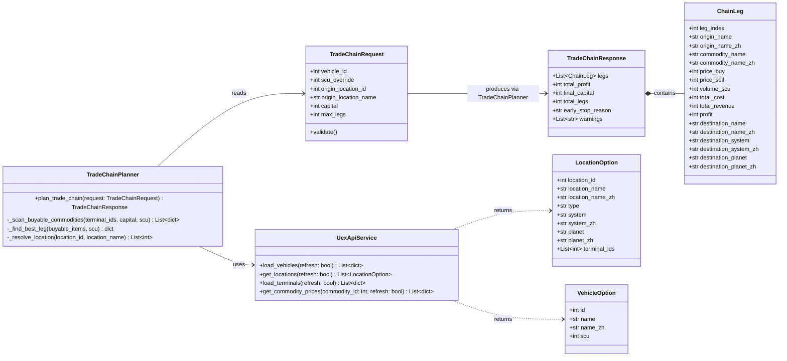
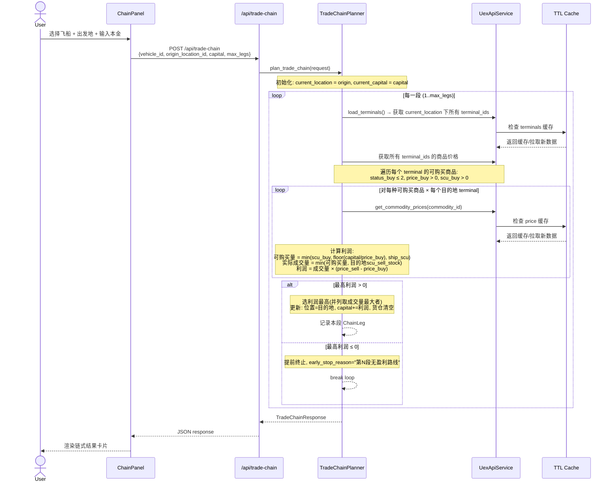
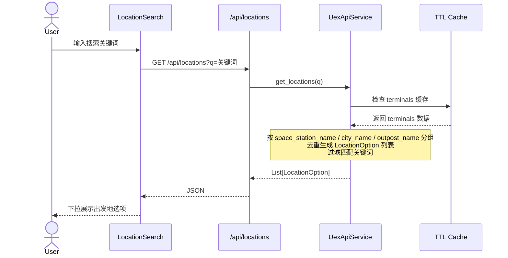
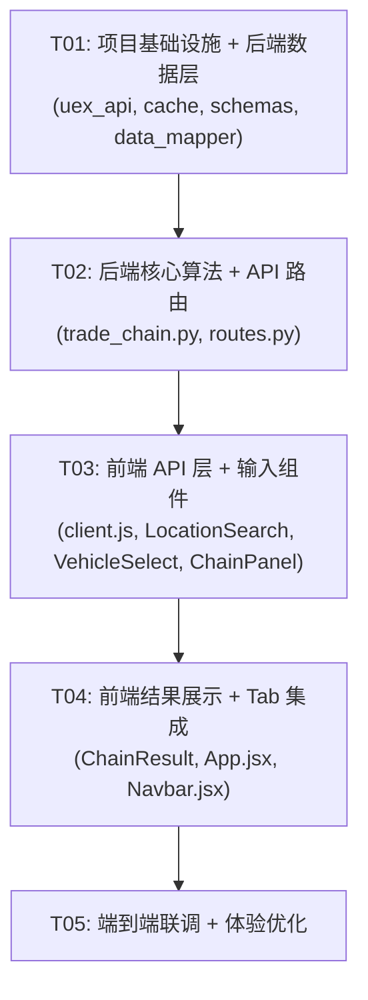

# 跑商链式路线规划 — 系统设计文档

## Part A: 系统设计

---

### 1. 实现方案

#### 1.1 核心技术挑战

| 挑战 | 说明 | 解决方案 |
|------|------|----------|
| **全量价格扫描** | 链式规划需要扫描所有 commodity 的 buy/sell 价格，而非用户指定商品 | 后端一次性加载所有价格数据（已有 `get_commodity_prices` 缓存机制），构建 origin → commodity → destination 的全量利润矩阵 |
| **位置 → Terminal 映射** | 用户选择"出发地"是 location 级别（空间站/城市），需映射到该位置下所有 terminal | 复用已有 `_get_location_key()` + `_build_location_index()` 机制，新增"按 location 分组"的出发地选项接口 |
| **链式迭代逻辑** | 每段结束位置变为下一段起点，资金滚存，需迭代计算 | 后端封装 `plan_trade_chain()` 函数，循环 max_legs 次，每次重新扫描当前 terminal 的可购货物 |
| **性能** | 全量扫描所有商品价格可能耗时较长 | 利用已有 TTL 缓存（6h terminals / 2h prices / 24h distances），首次请求后几乎全走缓存；全量价格只需 1 次 `/commodities_prices/` 批量拉取 |
| **Ship SCU 约束** | 不同飞船货仓容量不同，影响可购买量 | 新增 `/vehicles/` API 数据获取，前端选择飞船后传 SCU 给后端 |

#### 1.2 框架和库选择

| 层次 | 选择 | 理由 |
|------|------|------|
| **后端框架** | FastAPI（已有） | 与现有项目一致，支持异步、Pydantic 校验 |
| **前端框架** | React + MUI（已有） | 与现有项目一致 |
| **新增 API 数据源** | UEX 2.0 `/vehicles/` | 获取船型 SCU 数据 |
| **出发地数据** | 复用 `/terminals/` | 按 `space_station_name`/`city_name`/`outpost_name` 分组去重 |

#### 1.3 架构模式

沿用现有 MVC 分层：
- **Route 层**（`api/routes.py`）：新增 `/trade-chain` + `/locations` + `/vehicles` 端点
- **Service 层**（`services/trade_chain.py`）：新增链式规划核心算法
- **Service 层**（`services/uex_api.py`）：扩展 vehicles 数据获取 + location 分组
- **Schema 层**（`api/schemas.py`）：新增请求/响应 Pydantic 模型
- **前端组件**（`components/ChainPanel.jsx` + `ChainResult.jsx`）：新面板 + 结果展示

---

### 2. 文件列表

#### 2.1 后端新增/修改文件

| 文件路径 | 操作 | 说明 |
|----------|------|------|
| `backend/services/trade_chain.py` | **新增** | 链式路线规划核心算法 |
| `backend/services/uex_api.py` | **修改** | 新增 `load_vehicles()` + `get_locations()` |
| `backend/services/cache.py` | **修改** | 新增 `vehicle_cache` 实例 |
| `backend/api/schemas.py` | **修改** | 新增 `TradeChainRequest` / `TradeChainResponse` / `ChainLeg` / `LocationOption` / `VehicleOption` 等 schema |
| `backend/api/routes.py` | **修改** | 新增 `/trade-chain`、`/locations`、`/vehicles` 路由 |

#### 2.2 前端新增/修改文件

| 文件路径 | 操作 | 说明 |
|----------|------|------|
| `frontend/src/components/ChainPanel.jsx` | **新增** | 链式跑商输入面板（飞船/出发地/本金/段数） |
| `frontend/src/components/ChainResult.jsx` | **新增** | 链式结果展示组件（每段卡片 + 汇总） |
| `frontend/src/components/LocationSearch.jsx` | **新增** | 出发地搜索组件（按 location 分组） |
| `frontend/src/components/VehicleSelect.jsx` | **新增** | 飞船选择下拉组件 |
| `frontend/src/api/client.js` | **修改** | 新增 `tradeChain()`、`searchLocations()`、`getVehicles()` |
| `frontend/src/App.jsx` | **修改** | Tab 导航新增"链式跑商" |
| `frontend/src/components/Navbar.jsx` | **修改** | tabs 数组新增链式跑商项 |

---

### 3. 数据结构和接口

#### 3.1 类图



#### 3.2 API Request/Response Schema

**POST `/api/trade-chain`**

Request:
```python
class TradeChainRequest(BaseModel):
    vehicle_id: Optional[int] = None       # UEX vehicle ID
    scu_override: Optional[int] = None      # 手动输入 SCU（优先于 vehicle_id）
    origin_location_id: Optional[int] = None # 出发地 location ID
    origin_location_name: Optional[str] = None # 出发地名称（兼容模糊匹配）
    capital: int                             # 本金 (aUEC)
    max_legs: int = 5                        # 最大段数 (1-5)

    @field_validator('capital')
    def capital_must_be_positive(cls, v):
        if v <= 0:
            raise ValueError('capital must be greater than 0')
        return v

    @field_validator('max_legs')
    def max_legs_range(cls, v):
        if v < 1 or v > 5:
            raise ValueError('max_legs must be between 1 and 5')
        return v
```

Response:
```python
class ChainLeg(BaseModel):
    leg_index: int                    # 段序号 (1-based)
    origin_name: str                  # 出发 terminal 英文名
    origin_name_zh: str               # 出发 terminal 中文名
    commodity_name: str               # 货物英文名
    commodity_name_zh: str            # 货物中文名
    price_buy: int                    # 买入单价 (aUEC/SCU)
    price_sell: int                   # 卖出单价 (aUEC/SCU)
    volume_scu: int                   # 实际成交量 (SCU)
    total_cost: int                   # 本段总成本
    total_revenue: int                # 本段总收入
    profit: int                       # 本段利润
    destination_name: str             # 目的地英文名
    destination_name_zh: str          # 目的地中文名
    destination_system: str           # 目的地星系
    destination_system_zh: str        # 目的地星系中文
    destination_planet: str           # 目的地星球
    destination_planet_zh: str        # 目的地星球中文

class TradeChainResponse(BaseModel):
    legs: List[ChainLeg]              # 各段路线
    total_profit: int                 # 总利润
    final_capital: int                # 最终资金
    total_legs: int                   # 实际段数
    early_stop_reason: Optional[str]  # 提前终止原因
    warnings: List[str]               # 警告信息
```

**GET `/api/locations`**

Query: `q: str` (搜索关键词)

Response: `List[LocationOption]`
```python
class LocationOption(BaseModel):
    location_id: int                  # 分组后生成的唯一 ID
    location_name: str                # 英文名
    location_name_zh: str             # 中文名
    type: str                         # "space_station" | "city" | "outpost"
    system: str                       # 星系
    system_zh: str                    # 星系中文
    planet: str                       # 星球
    planet_zh: str                    # 星球中文
    terminal_ids: List[int]           # 该位置下所有 terminal ID
```

**GET `/api/vehicles`**

Query: `q: str` (搜索关键词，可选)

Response: `List[VehicleOption]`
```python
class VehicleOption(BaseModel):
    id: int                           # UEX vehicle ID
    name: str                         # 英文名
    name_zh: str                      # 中文名
    scu: int                          # 货仓容量
```

---

### 4. 程序调用流程



#### 4.1 出发地搜索流程



---

### 5. 待明确事项 (UNCLEAR)

| # | 事项 | 当前假设 | 备注 |
|---|------|----------|------|
| 1 | `/vehicles/` API 是否需要 API Key？ | 假设需要（与其他 UEX API 一致） | 如果不需要，可简化 |
| 2 | 飞船中文名来源？ | 前端维护一个 `VEHICLE_ZH_MAP`，类似 `TERMINAL_ZH_MAP` | UEX API 不提供中文名 |
| 3 | 同一 location 下多个 terminal 的可购买商品是否需要合并去重？ | 是，同一 commodity 在同 location 多个 terminal 出现时取最低 price_buy | 与现有 BuyPanel 逻辑一致 |
| 4 | 是否需要考虑量子燃料成本？ | 否，PRD 未提及 | 可作为 P2 扩展 |
| 5 | 前端 SCU 手动输入与飞船选择的优先级？ | `scu_override` 优先于 `vehicle_id`；如果都未提供，默认 SCU = 32（Freelancer 标准货仓） | PRD P0 要求飞船选择，但保留手动输入灵活性 |
| 6 | `/commodities_prices/` 批量拉取性能？ | 利用 PriceCache 逐商品缓存，首次可能需要多轮 API 调用 | UEX API 无全量价格接口，需逐 commodity_id 拉取 |

---

## Part B: 任务分解

---

### 6. 依赖包列表

```
# 后端 — 无新增依赖（已有 fastapi, pydantic, curl）

# 前端 — 无新增依赖（已有 react, @mui/material, axios）
```

> 所有核心功能可基于现有技术栈实现，无需新增第三方包。

---

### 7. 任务列表（按依赖顺序）

#### T01: 项目基础设施 + 后端数据层

**Source Files:**
- `backend/services/uex_api.py`（修改：新增 `load_vehicles()`, `get_locations()`）
- `backend/services/cache.py`（修改：新增 `vehicle_cache`, `TTL_VEHICLES`）
- `backend/api/schemas.py`（修改：新增 `TradeChainRequest`, `TradeChainResponse`, `ChainLeg`, `LocationOption`, `VehicleOption`）
- `backend/services/data_mapper.py`（修改：新增 `VEHICLE_ZH_MAP`, `get_vehicle_zh()`）

**Dependencies:** 无

**Priority:** P0

**Description:**
- 在 `cache.py` 中新增 `TTL_VEHICLES = 6 * 3600` 和 `vehicle_cache = TTLCache(TTL_VEHICLES, "vehicles")`
- 在 `uex_api.py` 中新增 `load_vehicles(refresh)` 从 UEX `/vehicles/` 拉取数据，过滤有 `scu > 0` 的船型
- 在 `uex_api.py` 中新增 `get_locations(q, refresh)` 方法：加载 terminals → 按 `space_station_name`/`city_name`/`outpost_name` 分组去重 → 生成 `LocationOption` 列表 → 按关键词过滤
- 在 `data_mapper.py` 中新增常用飞船中文名映射 `VEHICLE_ZH_MAP` 和 `get_vehicle_zh()` 函数
- 在 `schemas.py` 中新增所有新 Pydantic 模型：`TradeChainRequest`, `TradeChainResponse`, `ChainLeg`, `LocationOption`, `VehicleOption`

---

#### T02: 后端核心算法 + API 路由

**Source Files:**
- `backend/services/trade_chain.py`（新增）
- `backend/api/routes.py`（修改：新增 `/trade-chain`, `/locations`, `/vehicles` 路由）

**Dependencies:** T01

**Priority:** P0

**Description:**
- 新增 `trade_chain.py`，实现 `plan_trade_chain(request: TradeChainRequest) -> TradeChainResponse`
- 核心算法：
  1. 解析 SCU（`scu_override` > `vehicle_id` 对应 SCU > 默认 32）
  2. 解析出发地 location → 获取 terminal_ids
  3. 循环 max_legs 次：
     - 扫描当前 location 所有 terminal 的可购买商品（status_buy ≤ 2, price_buy > 0, scu_buy > 0）
     - 对每种可购买商品，遍历所有目的地 terminal 计算 profit
     - 选最优（利润最高，并列取成交量最大）
     - 若利润 ≤ 0，提前终止
     - 更新位置、资金
  4. 组装 `TradeChainResponse`
- 在 `routes.py` 中新增三个端点：
  - `POST /api/trade-chain` — 链式路线规划
  - `GET /api/locations` — 出发地搜索
  - `GET /api/vehicles` — 飞船列表搜索

---

#### T03: 前端 API 层 + 输入组件

**Source Files:**
- `frontend/src/api/client.js`（修改：新增 `tradeChain()`, `searchLocations()`, `getVehicles()`）
- `frontend/src/components/LocationSearch.jsx`（新增）
- `frontend/src/components/VehicleSelect.jsx`（新增）
- `frontend/src/components/ChainPanel.jsx`（新增）

**Dependencies:** T02（需要后端 API 可用）

**Priority:** P0

**Description:**
- 在 `client.js` 中新增三个 API 调用函数
- 新增 `LocationSearch.jsx`：基于 TerminalSearch 模式，调用 `/api/locations`，展示 location 级别选项（空间站/城市），选中后传递 `location_id` + `terminal_ids`
- 新增 `VehicleSelect.jsx`：调用 `/api/vehicles`，下拉选择飞船（显示名称 + SCU），支持搜索；包含"自定义 SCU"选项
- 新增 `ChainPanel.jsx`：组合 VehicleSelect + LocationSearch + 本金输入 + 段数选择 + 规划按钮，提交后调用 `/api/trade-chain`

---

#### T04: 前端结果展示 + Tab 集成

**Source Files:**
- `frontend/src/components/ChainResult.jsx`（新增）
- `frontend/src/App.jsx`（修改：新增 chain tab 逻辑）
- `frontend/src/components/Navbar.jsx`（修改：tabs 数组新增链式跑商）

**Dependencies:** T03

**Priority:** P0

**Description:**
- 新增 `ChainResult.jsx`：
  - 汇总面板：总利润、最终资金、总段数
  - 每段 Leg 卡片：出发地 → 货物(×成交量) → 目的地，买入价/卖出价/利润
  - 段间箭头连接线（时间线风格，复用 RouteTimeline 视觉）
  - 提前终止提示："第N段无盈利路线"
  - 无数据友好提示
- 修改 `Navbar.jsx`：tabs 新增 `{ key: 'chain', label: '链式跑商', icon: <Link /> }`
- 修改 `App.jsx`：
  - `activeTab` 新增 `'chain'` 选项
  - 左面板条件渲染 `ChainPanel`
  - 右面板条件渲染 `ChainResult`

---

#### T05: 端到端联调 + 体验优化

**Source Files:**
- `backend/services/trade_chain.py`（优化）
- `frontend/src/components/ChainPanel.jsx`（优化）
- `frontend/src/components/ChainResult.jsx`（优化）

**Dependencies:** T04

**Priority:** P1

**Description:**
- 后端优化：对全量价格扫描的性能优化，考虑批量预加载常见商品价格
- 前端优化：
  - Loading 状态优化（链式规划可能耗时较长，展示分段进度提示）
  - 错误处理（网络超时、无数据等场景）
  - 结果动画（段卡片依次滑入）
  - 响应式布局适配
- 验证：确保全链路从飞船选择到结果展示正常工作

---

### 8. 共享知识

```
- UEX API 价格语义（PLAYER 视角）：
  - price_buy  = 玩家从 terminal 买入的价格（terminal 卖出价）
  - price_sell = 玩家向 terminal 卖出的价格（terminal 收购价）
  - scu_buy        = terminal 可供玩家购买的库存
  - scu_sell_stock = terminal 收购需求量

- API 响应格式：遵循现有 FastAPI + Pydantic 序列化，无额外包装层
- 错误处理：HTTP 500 + detail 字符串（与现有 /buy-route, /sell-route 一致）
- 中英文名映射：统一使用 data_mapper.py 中的映射表 + get_xxx_zh() 函数
- 缓存策略：vehicles 与 terminals 同级 TTL（6小时），价格 2 小时
- 出发地类型：space_station / city / outpost，存储在 LocationOption.type 字段
- SCU 来源优先级：scu_override > vehicle_id 对应 SCU > 默认 32
- 最大段数：1-5，默认 5
- 提前终止条件：某段最高利润 ≤ 0
- 利润并列时选择成交量最大者
- Terminal 过滤：复用 _is_valid_commodity_terminal() 过滤非交易终端
- 前端 API 调用：通过 Vite proxy /api → localhost:8000，与现有面板一致
- 前端样式：复用 HUD 太空风（Orbitron 字体、渐变边框、clipPath 切角）
```

---

### 9. 任务依赖图


